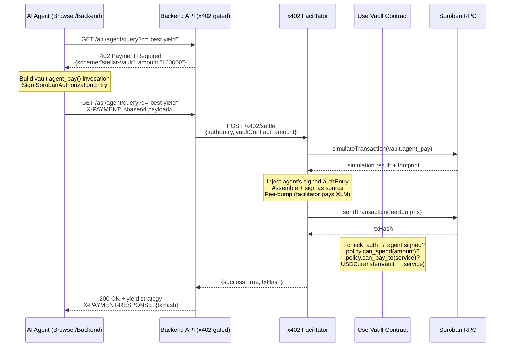
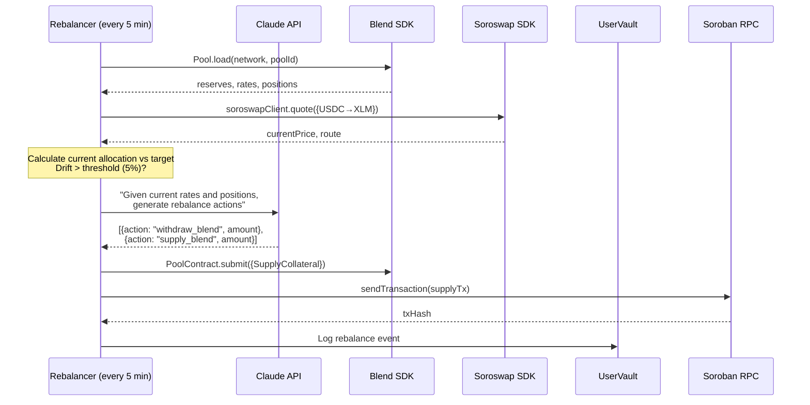

# CLAUDE.md — AgentNet Stellar: Production Build Specification

> **This file is the single-source-of-truth for Claude Code.**
> Execute phases in order. Do NOT skip ahead. Each phase has a CHECKPOINT.
> **Hackathon**: February 20, 2026 | **Network**: Stellar Testnet only

---

## BUILD PHASES (Execute in order)

| Phase | What | Checkpoint |
|-------|------|-----------|
| 1 | Environment + monorepo scaffold | `pnpm install` succeeds in root |
| 2 | Soroban contracts (3 crates) | `cargo test --workspace` passes |
| 3 | Contract deployment scripts | `pnpm deploy:contracts` deploys to testnet |
| 4 | Backend + AI + rebalancer (merged) | `pnpm dev:backend` starts, `/health` returns 200 |
| 5 | x402 facilitator + middleware | `POST /x402/settle` returns mock settlement |
| 6 | NextJS frontend — landing + app shell | `pnpm dev:web` loads at localhost:3000 |
| 7 | Frontend — vault + registry pages | Create vault + deposit + register agent flows work |
| 8 | Frontend — agent chat + x402 visualization | Full demo flow completes |
| 9 | Integration tests | All e2e tests pass against testnet |
| 10 | Polish + deploy | Vercel frontend + Railway backend live |

---

## ARCHITECTURE DIAGRAMS

### System Overview (Mermaid — save as `docs/architecture.mermaid`)

```mermaid
graph TB
    subgraph "Frontend (NextJS 15 — App Router)"
        LP["Landing Page<br/>/"]
        DASH["Dashboard<br/>/app"]
        VAULT["Vault Manager<br/>/app/vault"]
        AGENTS["Agent Marketplace<br/>/app/agents"]
        CHAT["Agent Chat<br/>/app/chat"]
        REG["Register Agent<br/>/app/register"]
    end

    subgraph "Backend (Express + TypeScript — Merged AI/x402)"
        API["REST API<br/>port 3001"]
        X402M["x402 Middleware"]
        FACIL["Facilitator<br/>/x402/settle"]
        AI["AI Engine<br/>Claude API"]
        REB["Rebalancer<br/>cron job"]
        BLEND_C["Blend Client<br/>@blend-capital/blend-sdk"]
        SORO_C["Soroswap Client<br/>@soroswap/sdk"]
        STELLAR["Stellar Client<br/>@stellar/stellar-sdk"]
    end

    subgraph "Soroban Smart Contracts (Rust)"
        VF["VaultFactory<br/>deploys vaults"]
        UV["UserVault<br/>C-account, agent_pay()"]
        AR["AgentRegistry<br/>ERC-8004 NFT"]
    end

    subgraph "Stellar Testnet"
        USDC["USDC SAC"]
        BPOOL["Blend Pools"]
        SPOOL["Soroswap AMM"]
        HORIZON["Horizon API"]
        RPC["Soroban RPC"]
    end

    LP --> DASH
    DASH --> API
    VAULT -->|Freighter Sign| VF
    VAULT -->|Deposit USDC| UV
    AGENTS --> AR
    CHAT -->|x402 header| X402M
    REG -->|Freighter Sign| AR

    X402M -->|verify| FACIL
    FACIL -->|submit tx| RPC
    FACIL -->|agent_pay()| UV

    API --> AI
    AI -->|strategy| BLEND_C
    AI -->|strategy| SORO_C
    REB -->|supply/withdraw| BLEND_C
    REB -->|swap| SORO_C
    BLEND_C --> BPOOL
    SORO_C --> SPOOL
    STELLAR --> RPC
    STELLAR --> HORIZON

    VF -->|deploy instance| UV
    UV -->|transfer USDC| USDC
    UV -.->|check agent policy| AR
```

### x402 Payment Flow (save as `docs/x402-flow.mermaid`)



### Rebalancing Flow (save as `docs/rebalancing-flow.mermaid`)



---

## COMPLETE DIRECTORY TREE

Every file listed below MUST exist. Files marked `[GENERATE]` are created by build tools.

```
agentnet-stellar/
├── CLAUDE.md                              ← THIS FILE
├── README.md
├── package.json                           ← pnpm workspace root
├── pnpm-workspace.yaml
├── turbo.json                             ← Turborepo config
├── .env.example
├── .gitignore
│
├── docs/
│   ├── architecture.mermaid
│   ├── x402-flow.mermaid
│   ├── rebalancing-flow.mermaid
│   └── x402-stellar-spec.md
│
├── contracts/                             ← Soroban Rust workspace
│   ├── Cargo.toml                         ← workspace root
│   ├── Makefile
│   ├── vault-factory/
│   │   ├── Cargo.toml
│   │   └── src/
│   │       ├── lib.rs
│   │       └── test.rs
│   ├── user-vault/
│   │   ├── Cargo.toml
│   │   └── src/
│   │       ├── lib.rs
│   │       ├── types.rs                   ← AgentPolicy, VaultError, DataKey
│   │       ├── agent.rs                   ← agent_pay, add/remove agent
│   │       ├── owner.rs                   ← deposit, withdraw, admin fns
│   │       └── test.rs
│   ├── agent-registry/
│   │   ├── Cargo.toml
│   │   └── src/
│   │       ├── lib.rs
│   │       ├── types.rs                   ← AgentInfo, ERC8004Metadata
│   │       └── test.rs
│   └── target/                            [GENERATE]
│       └── wasm32-unknown-unknown/release/
│           ├── vault_factory.wasm         [GENERATE]
│           ├── user_vault.wasm            [GENERATE]
│           └── agent_registry.wasm        [GENERATE]
│
├── packages/
│   └── shared/                            ← Shared types + constants
│       ├── package.json
│       ├── tsconfig.json
│       └── src/
│           ├── index.ts                   ← barrel export
│           ├── contracts.ts               ← contract addresses, ABIs
│           ├── x402-types.ts              ← x402 protocol types
│           ├── stellar-config.ts          ← network config
│           └── errors.ts                  ← shared error codes
│
├── apps/
│   ├── web/                               ← NextJS 15 frontend
│   │   ├── package.json
│   │   ├── next.config.ts
│   │   ├── tailwind.config.ts
│   │   ├── tsconfig.json
│   │   ├── postcss.config.mjs
│   │   ├── public/
│   │   │   ├── logo.svg
│   │   │   ├── og-image.png
│   │   │   └── fonts/
│   │   │       └── GeistMono-Regular.woff2
│   │   └── src/
│   │       ├── app/                       ← App Router
│   │       │   ├── layout.tsx             ← Root layout + providers
│   │       │   ├── page.tsx               ← Landing page (marketing)
│   │       │   ├── globals.css
│   │       │   ├── (marketing)/
│   │       │   │   └── page.tsx           ← Re-export of landing
│   │       │   └── (dashboard)/
│   │       │       ├── layout.tsx         ← Dashboard layout (sidebar+nav)
│   │       │       ├── app/
│   │       │       │   └── page.tsx       ← Dashboard overview
│   │       │       ├── vault/
│   │       │       │   └── page.tsx       ← Vault: create/deposit/withdraw
│   │       │       ├── agents/
│   │       │       │   └── page.tsx       ← Agent marketplace browse
│   │       │       ├── chat/
│   │       │       │   └── page.tsx       ← Agent query + x402 payment viz
│   │       │       ├── register/
│   │       │       │   └── page.tsx       ← Register new agent
│   │       │       └── history/
│   │       │           └── page.tsx       ← Transaction history
│   │       ├── components/
│   │       │   ├── landing/
│   │       │   │   ├── Hero.tsx
│   │       │   │   ├── Features.tsx
│   │       │   │   ├── HowItWorks.tsx
│   │       │   │   ├── Architecture.tsx
│   │       │   │   ├── Pricing.tsx
│   │       │   │   └── Footer.tsx
│   │       │   ├── dashboard/
│   │       │   │   ├── Sidebar.tsx
│   │       │   │   ├── TopNav.tsx
│   │       │   │   ├── WalletButton.tsx
│   │       │   │   └── StatsCards.tsx
│   │       │   ├── vault/
│   │       │   │   ├── CreateVaultCard.tsx
│   │       │   │   ├── DepositForm.tsx
│   │       │   │   ├── WithdrawForm.tsx
│   │       │   │   ├── VaultBalance.tsx
│   │       │   │   └── AgentList.tsx
│   │       │   ├── agents/
│   │       │   │   ├── AgentCard.tsx
│   │       │   │   ├── AgentGrid.tsx
│   │       │   │   └── AgentDetail.tsx
│   │       │   ├── chat/
│   │       │   │   ├── ChatWindow.tsx
│   │       │   │   ├── MessageBubble.tsx
│   │       │   │   ├── StrategyCard.tsx
│   │       │   │   ├── X402PaymentBanner.tsx
│   │       │   │   └── QueryInput.tsx
│   │       │   ├── register/
│   │       │   │   └── RegisterForm.tsx
│   │       │   └── ui/                    ← Shared UI primitives
│   │       │       ├── Button.tsx
│   │       │       ├── Card.tsx
│   │       │       ├── Input.tsx
│   │       │       ├── Badge.tsx
│   │       │       ├── Dialog.tsx
│   │       │       ├── Spinner.tsx
│   │       │       ├── Toast.tsx
│   │       │       └── TxLink.tsx         ← Stellar Expert tx link
│   │       ├── hooks/
│   │       │   ├── useWallet.ts           ← Freighter connect/sign
│   │       │   ├── useVault.ts            ← create/deposit/withdraw
│   │       │   ├── useRegistry.ts         ← register/list agents
│   │       │   ├── useX402.ts             ← build x402 header + pay
│   │       │   ├── useAgentChat.ts        ← chat state management
│   │       │   └── useStellar.ts          ← rpc + tx helpers
│   │       ├── lib/
│   │       │   ├── stellar.ts             ← SDK initialization
│   │       │   ├── contracts.ts           ← contract client factory
│   │       │   ├── freighter.ts           ← Freighter wallet adapter
│   │       │   └── api.ts                 ← Backend API client
│   │       ├── providers/
│   │       │   ├── WalletProvider.tsx
│   │       │   └── ToastProvider.tsx
│   │       └── types/
│   │           ├── vault.ts
│   │           ├── agent.ts
│   │           └── x402.ts
│   │
│   └── backend/                           ← Express.js (Backend + AI + x402)
│       ├── package.json
│       ├── tsconfig.json
│       ├── nodemon.json
│       ├── .env.example
│       └── src/
│           ├── index.ts                   ← Express app bootstrap
│           ├── config.ts                  ← env vars + validation
│           │
│           ├── routes/
│           │   ├── index.ts               ← route aggregator
│           │   ├── vault.routes.ts        ← GET /api/vaults/:owner etc
│           │   ├── agent.routes.ts        ← GET /api/agents, POST /api/agents
│           │   ├── stats.routes.ts        ← GET /api/stats
│           │   ├── yield.routes.ts        ← GET /api/yield/query (x402-gated)
│           │   └── rebalance.routes.ts    ← POST /api/rebalance/trigger
│           │
│           ├── middleware/
│           │   ├── x402.middleware.ts      ← x402 payment gate
│           │   ├── error.middleware.ts     ← global error handler
│           │   └── logger.middleware.ts    ← request logging
│           │
│           ├── x402/
│           │   ├── facilitator.ts         ← verify + settle x402 payments
│           │   ├── types.ts               ← PaymentRequirements, PaymentPayload
│           │   ├── header-builder.ts      ← agent-side: build X-PAYMENT header
│           │   └── stellar-tx.ts          ← tx construction helpers
│           │
│           ├── ai/
│           │   ├── engine.ts              ← Claude API wrapper
│           │   ├── prompts.ts             ← system prompts for yield/rebalance
│           │   ├── yield-optimizer.ts     ← query yield + generate strategy
│           │   └── strategy-types.ts      ← YieldStrategy, RiskLevel types
│           │
│           ├── defi/
│           │   ├── blend-client.ts        ← Blend SDK: load pool, supply, withdraw
│           │   ├── soroswap-client.ts     ← Soroswap SDK: quote, swap
│           │   ├── pool-scanner.ts        ← scan all pools, aggregate rates
│           │   └── rebalancer.ts          ← rebalancing engine + cron
│           │
│           ├── stellar/
│           │   ├── client.ts              ← RPC + Horizon helpers
│           │   ├── tx-builder.ts          ← build + simulate + submit
│           │   └── contract-reader.ts     ← read vault/registry state
│           │
│           ├── services/
│           │   ├── vault.service.ts       ← vault CRUD operations
│           │   ├── agent.service.ts       ← agent registry operations
│           │   └── deployment.service.ts  ← contract deployment logic
│           │
│           └── scripts/
│               ├── deploy-contracts.ts    ← stellar contract deploy
│               ├── setup-testnet.ts       ← fund accounts, mint USDC
│               └── seed-agents.ts         ← register demo agents
│
├── tests/
│   ├── unit/
│   │   ├── ai-engine.test.ts
│   │   ├── blend-client.test.ts
│   │   ├── soroswap-client.test.ts
│   │   ├── x402-middleware.test.ts
│   │   ├── facilitator.test.ts
│   │   ├── rebalancer.test.ts
│   │   └── yield-optimizer.test.ts
│   ├── integration/
│   │   ├── vault-flow.test.ts             ← create vault → deposit → agent_pay
│   │   ├── x402-flow.test.ts              ← full 402 → payment → 200 cycle
│   │   ├── blend-integration.test.ts      ← supply to real Blend testnet pool
│   │   ├── registry-flow.test.ts          ← register → query → deactivate
│   │   └── rebalance-flow.test.ts         ← trigger rebalance → verify positions
│   └── e2e/
│       └── demo-flow.test.ts              ← full hackathon demo script as test
│
└── scripts/
    ├── build-contracts.sh                 ← cargo build + optimize
    ├── deploy.sh                          ← full deployment pipeline
    └── demo.sh                            ← automated demo runner
```

---

## PHASE 1: ENVIRONMENT + MONOREPO SCAFFOLD

### Root `package.json`

```json
{
  "name": "agentnet-stellar",
  "private": true,
  "scripts": {
    "dev": "turbo dev",
    "dev:web": "turbo dev --filter=@agentnet/web",
    "dev:backend": "turbo dev --filter=@agentnet/backend",
    "build": "turbo build",
    "build:contracts": "cd contracts && cargo build --release --target wasm32-unknown-unknown",
    "test": "turbo test",
    "test:contracts": "cd contracts && cargo test --workspace",
    "test:unit": "vitest run --config tests/vitest.config.ts",
    "test:integration": "vitest run --config tests/vitest.integration.config.ts",
    "deploy:contracts": "pnpm --filter @agentnet/backend exec tsx src/scripts/deploy-contracts.ts",
    "setup:testnet": "pnpm --filter @agentnet/backend exec tsx src/scripts/setup-testnet.ts",
    "lint": "turbo lint",
    "clean": "turbo clean && rm -rf node_modules"
  },
  "devDependencies": {
    "turbo": "^2.3.0",
    "vitest": "^2.1.0",
    "typescript": "^5.7.0"
  },
  "packageManager": "pnpm@9.15.0",
  "engines": {
    "node": ">=20.0.0"
  }
}
```

### `pnpm-workspace.yaml`

```yaml
packages:
  - "apps/*"
  - "packages/*"
```

### `turbo.json`

```json
{
  "$schema": "https://turbo.build/schema.json",
  "tasks": {
    "dev": {
      "persistent": true,
      "cache": false
    },
    "build": {
      "dependsOn": ["^build"],
      "outputs": [".next/**", "dist/**"]
    },
    "test": {
      "dependsOn": ["build"]
    },
    "lint": {}
  }
}
```

### `.env.example`

```bash
# ── Stellar Network ──
STELLAR_RPC_URL=https://soroban-testnet.stellar.org
STELLAR_HORIZON_URL=https://horizon-testnet.stellar.org
STELLAR_NETWORK_PASSPHRASE="Test SDF Network ; September 2015"

# ── Contract Addresses (filled after deploy) ──
VAULT_FACTORY_ADDRESS=
AGENT_REGISTRY_ADDRESS=
USDC_SAC_ADDRESS=
VAULT_WASM_HASH=

# ── Keypairs (stellar keys generate <name> --network testnet --fund) ──
ADMIN_SECRET_KEY=
FACILITATOR_SECRET_KEY=
AGENT_SIGNER_SECRET_KEY=

# ── AI ──
ANTHROPIC_API_KEY=

# ── Soroswap ──
SOROSWAP_API_KEY=

# ── Backend ──
PORT=3001
NODE_ENV=development

# ── Frontend ──
NEXT_PUBLIC_BACKEND_URL=http://localhost:3001
NEXT_PUBLIC_STELLAR_NETWORK=testnet
NEXT_PUBLIC_VAULT_FACTORY_ADDRESS=
NEXT_PUBLIC_AGENT_REGISTRY_ADDRESS=
NEXT_PUBLIC_USDC_SAC_ADDRESS=
```

### `.gitignore`

```
node_modules/
.next/
dist/
target/
.env
.env.local
.env.contracts
*.wasm
.turbo/
```

**PHASE 1 CHECKPOINT**: Run `pnpm install` at root. Should resolve all workspaces.

---

## PHASE 2: SOROBAN CONTRACTS

### `contracts/Cargo.toml` (workspace root)

```toml
[workspace]
resolver = "2"
members = [
    "vault-factory",
    "user-vault",
    "agent-registry",
]

[workspace.dependencies]
soroban-sdk = "=22.0.0"

[profile.release]
opt-level = "z"
overflow-checks = true
debug = 0
strip = "symbols"
debug-assertions = false
panic = "abort"
codegen-units = 1
lto = true

[profile.release-with-logs]
inherits = "release"
debug-assertions = true
```

### `contracts/Makefile`

```makefile
.PHONY: build test clean

build:
	cargo build --release --target wasm32-unknown-unknown

test:
	cargo test --workspace

clean:
	cargo clean
```

---

### CONTRACT A: `user-vault/` — The Smart Account

This is the CORE contract. A per-user Soroban C-account holding USDC, with agent-delegated spending.

#### `user-vault/Cargo.toml`

```toml
[package]
name = "user-vault"
version = "0.1.0"
edition = "2021"

[lib]
crate-type = ["cdylib"]
doctest = false

[dependencies]
soroban-sdk = { workspace = true }

[dev-dependencies]
soroban-sdk = { workspace = true, features = ["testutils"] }
```

#### `user-vault/src/types.rs`

```rust
use soroban_sdk::{contracttype, contracterror, Address, Vec};

/// Error codes returned by vault operations
#[contracterror]
#[derive(Copy, Clone, Debug, Eq, PartialEq, PartialOrd, Ord)]
#[repr(u32)]
pub enum VaultError {
    AlreadyInitialized = 1,
    NotInitialized = 2,
    NotOwner = 3,
    AgentNotFound = 4,
    AgentInactive = 5,
    ExceedsDailyLimit = 6,
    DestinationNotAllowed = 7,
    InsufficientBalance = 8,
    DuplicateAgent = 9,
    InvalidAmount = 10,
}

/// Storage keys for the vault contract
#[contracttype]
pub enum DataKey {
    Owner,                    // Address — vault owner
    UsdcToken,                // Address — USDC SAC
    Factory,                  // Address — VaultFactory that deployed this
    AgentPolicy(Address),     // AgentPolicy — per-agent spending rules
    AgentList,                // Vec<Address> — all agents
    AgentCount,               // u32
    Initialized,              // bool
    TotalSpent,               // i128 — lifetime USDC spent through agent_pay
    TxNonce,                  // u64 — incrementing nonce for memo uniqueness
}

/// Per-agent spending policy, enforced on-chain in every agent_pay() call
#[contracttype]
#[derive(Clone, Debug)]
pub struct AgentPolicy {
    pub agent_address: Address,
    /// Max USDC per 24h rolling window. In stroops (7 decimals).
    /// 10 USDC = 10_0000000 = 100_000_000
    pub daily_limit: i128,
    /// Amount spent in current window
    pub spent_today: i128,
    /// Ledger timestamp when window started
    pub last_reset: u64,
    /// Addresses this agent may pay. Empty = any address.
    pub allowed_destinations: Vec<Address>,
    /// Whether this agent is currently active
    pub is_active: bool,
}

impl AgentPolicy {
    /// Check if the agent can spend `amount` right now.
    /// Auto-resets the window if 24h (86400s) have elapsed.
    pub fn available_limit(&self, now: u64) -> i128 {
        let spent = if now.saturating_sub(self.last_reset) >= 86400 {
            0i128
        } else {
            self.spent_today
        };
        self.daily_limit.saturating_sub(spent)
    }

    /// Check if destination is in allowed list. Empty = any allowed.
    pub fn is_destination_allowed(&self, dest: &Address) -> bool {
        if self.allowed_destinations.is_empty() {
            return true;
        }
        for i in 0..self.allowed_destinations.len() {
            if self.allowed_destinations.get(i).unwrap() == dest.clone() {
                return true;
            }
        }
        false
    }

    /// Record a spend. Resets window if needed.
    pub fn record_spend(&mut self, amount: i128, now: u64) {
        if now.saturating_sub(self.last_reset) >= 86400 {
            self.spent_today = amount;
            self.last_reset = now;
        } else {
            self.spent_today = self.spent_today.saturating_add(amount);
        }
    }
}
```

#### `user-vault/src/owner.rs`

```rust
//! Owner-only functions: deposit, withdraw, manage agents

use crate::types::{AgentPolicy, DataKey, VaultError};
use soroban_sdk::{contract, contractimpl, token, Address, Env, Symbol, Vec};

use crate::UserVault;

/// Owner operations — all require owner.require_auth()
#[contractimpl]
impl UserVault {
    /// Called by VaultFactory.create_vault(). One-time initialization.
    pub fn initialize(
        env: Env,
        owner: Address,
        usdc_token: Address,
        factory: Address,
    ) -> Result<(), VaultError> {
        if env.storage().instance().has(&DataKey::Initialized) {
            return Err(VaultError::AlreadyInitialized);
        }
        env.storage().instance().set(&DataKey::Owner, &owner);
        env.storage().instance().set(&DataKey::UsdcToken, &usdc_token);
        env.storage().instance().set(&DataKey::Factory, &factory);
        env.storage().instance().set(&DataKey::AgentCount, &0u32);
        env.storage().instance().set(&DataKey::AgentList, &Vec::<Address>::new(&env));
        env.storage().instance().set(&DataKey::Initialized, &true);
        env.storage().instance().set(&DataKey::TotalSpent, &0i128);
        env.storage().instance().set(&DataKey::TxNonce, &0u64);
        Ok(())
    }

    /// Deposit USDC into vault. Anyone can deposit (vault could receive tips).
    /// Commonly the owner deposits.
    pub fn deposit(env: Env, from: Address, amount: i128) -> Result<(), VaultError> {
        from.require_auth();
        if amount <= 0 {
            return Err(VaultError::InvalidAmount);
        }
        let usdc: Address = env.storage().instance().get(&DataKey::UsdcToken).unwrap();
        token::Client::new(&env, &usdc).transfer(&from, &env.current_contract_address(), &amount);
        env.events().publish((Symbol::new(&env, "deposit"),), (from, amount));
        Ok(())
    }

    /// Withdraw USDC from vault. Owner only.
    pub fn withdraw(env: Env, owner: Address, amount: i128) -> Result<(), VaultError> {
        owner.require_auth();
        Self::require_owner(&env, &owner)?;
        if amount <= 0 {
            return Err(VaultError::InvalidAmount);
        }
        let usdc: Address = env.storage().instance().get(&DataKey::UsdcToken).unwrap();
        let token_client = token::Client::new(&env, &usdc);
        let bal = token_client.balance(&env.current_contract_address());
        if bal < amount {
            return Err(VaultError::InsufficientBalance);
        }
        token_client.transfer(&env.current_contract_address(), &owner, &amount);
        env.events().publish((Symbol::new(&env, "withdraw"),), (owner, amount));
        Ok(())
    }

    /// Authorize an agent with a daily spending limit.
    pub fn add_agent(
        env: Env,
        owner: Address,
        agent: Address,
        daily_limit: i128,
        allowed_destinations: Vec<Address>,
    ) -> Result<(), VaultError> {
        owner.require_auth();
        Self::require_owner(&env, &owner)?;

        // Check for duplicate
        if env.storage().persistent().has(&DataKey::AgentPolicy(agent.clone())) {
            let existing: AgentPolicy = env.storage().persistent().get(&DataKey::AgentPolicy(agent.clone())).unwrap();
            if existing.is_active {
                return Err(VaultError::DuplicateAgent);
            }
        }

        let policy = AgentPolicy {
            agent_address: agent.clone(),
            daily_limit,
            spent_today: 0,
            last_reset: env.ledger().timestamp(),
            allowed_destinations,
            is_active: true,
        };
        env.storage().persistent().set(&DataKey::AgentPolicy(agent.clone()), &policy);

        // Add to agent list
        let mut agents: Vec<Address> = env.storage().instance()
            .get(&DataKey::AgentList).unwrap_or(Vec::new(&env));
        agents.push_back(agent.clone());
        env.storage().instance().set(&DataKey::AgentList, &agents);

        let count: u32 = env.storage().instance().get(&DataKey::AgentCount).unwrap_or(0);
        env.storage().instance().set(&DataKey::AgentCount, &(count + 1));

        env.events().publish((Symbol::new(&env, "agent_added"),), (agent, daily_limit));
        Ok(())
    }

    /// Deactivate an agent. Revokes spending authority.
    pub fn remove_agent(env: Env, owner: Address, agent: Address) -> Result<(), VaultError> {
        owner.require_auth();
        Self::require_owner(&env, &owner)?;

        let mut policy: AgentPolicy = env.storage().persistent()
            .get(&DataKey::AgentPolicy(agent.clone()))
            .ok_or(VaultError::AgentNotFound)?;
        policy.is_active = false;
        env.storage().persistent().set(&DataKey::AgentPolicy(agent.clone()), &policy);

        env.events().publish((Symbol::new(&env, "agent_removed"),), (agent,));
        Ok(())
    }

    /// Update daily limit for an agent.
    pub fn set_agent_limit(
        env: Env,
        owner: Address,
        agent: Address,
        new_limit: i128,
    ) -> Result<(), VaultError> {
        owner.require_auth();
        Self::require_owner(&env, &owner)?;

        let mut policy: AgentPolicy = env.storage().persistent()
            .get(&DataKey::AgentPolicy(agent.clone()))
            .ok_or(VaultError::AgentNotFound)?;
        policy.daily_limit = new_limit;
        env.storage().persistent().set(&DataKey::AgentPolicy(agent.clone()), &policy);
        Ok(())
    }

    // ── VIEW FUNCTIONS ──

    pub fn balance(env: Env) -> i128 {
        let usdc: Address = env.storage().instance().get(&DataKey::UsdcToken).unwrap();
        token::Client::new(&env, &usdc).balance(&env.current_contract_address())
    }

    pub fn owner(env: Env) -> Address {
        env.storage().instance().get(&DataKey::Owner).unwrap()
    }

    pub fn get_agent_policy(env: Env, agent: Address) -> Result<AgentPolicy, VaultError> {
        env.storage().persistent()
            .get(&DataKey::AgentPolicy(agent))
            .ok_or(VaultError::AgentNotFound)
    }

    pub fn remaining_limit(env: Env, agent: Address) -> Result<i128, VaultError> {
        let policy: AgentPolicy = env.storage().persistent()
            .get(&DataKey::AgentPolicy(agent))
            .ok_or(VaultError::AgentNotFound)?;
        Ok(policy.available_limit(env.ledger().timestamp()))
    }

    pub fn list_agents(env: Env) -> Vec<Address> {
        env.storage().instance()
            .get(&DataKey::AgentList)
            .unwrap_or(Vec::new(&env))
    }

    pub fn agent_count(env: Env) -> u32 {
        env.storage().instance().get(&DataKey::AgentCount).unwrap_or(0)
    }

    pub fn total_spent(env: Env) -> i128 {
        env.storage().instance().get(&DataKey::TotalSpent).unwrap_or(0)
    }

    // ── INTERNAL ──

    pub(crate) fn require_owner(env: &Env, caller: &Address) -> Result<(), VaultError> {
        let owner: Address = env.storage().instance().get(&DataKey::Owner).unwrap();
        if *caller != owner {
            return Err(VaultError::NotOwner);
        }
        Ok(())
    }
}
```

#### `user-vault/src/agent.rs`

```rust
//! Agent functions — the x402 payment entry point

use crate::types::{DataKey, VaultError};
use crate::UserVault;
use soroban_sdk::{contractimpl, token, Address, Env, Symbol};

#[contractimpl]
impl UserVault {
    /// THE x402 PAYMENT FUNCTION.
    ///
    /// Called by an authorized agent to pay for a service from vault funds.
    /// The agent MUST sign a SorobanAuthorizationEntry for this invocation.
    /// The vault enforces: agent is registered, active, within daily limit,
    /// and destination is in the allowed list.
    ///
    /// ## Arguments
    /// * `agent` — Agent address (must call require_auth)
    /// * `pay_to` — Service receiving payment
    /// * `amount` — USDC in stroops (7 decimals). 0.01 USDC = 100_000
    /// * `memo` — Audit trail memo (e.g. "yield_query_abc123")
    ///
    /// ## Errors
    /// * `AgentNotFound` — agent not registered on this vault
    /// * `AgentInactive` — agent was deactivated by owner
    /// * `ExceedsDailyLimit` — agent has hit 24h spending cap
    /// * `DestinationNotAllowed` — pay_to not in agent's allowed list
    /// * `InsufficientBalance` — vault doesn't have enough USDC
    /// * `InvalidAmount` — amount <= 0
    pub fn agent_pay(
        env: Env,
        agent: Address,
        pay_to: Address,
        amount: i128,
        memo: Symbol,
    ) -> Result<(), VaultError> {
        // 1. Agent MUST authenticate this call
        agent.require_auth();

        if amount <= 0 {
            return Err(VaultError::InvalidAmount);
        }

        // 2. Load + validate agent policy
        let mut policy = env.storage().persistent()
            .get(&DataKey::AgentPolicy(agent.clone()))
            .ok_or(VaultError::AgentNotFound)?;

        if !policy.is_active {
            return Err(VaultError::AgentInactive);
        }

        // 3. Check destination whitelist
        if !policy.is_destination_allowed(&pay_to) {
            return Err(VaultError::DestinationNotAllowed);
        }

        // 4. Check daily spending limit
        let now = env.ledger().timestamp();
        if policy.available_limit(now) < amount {
            return Err(VaultError::ExceedsDailyLimit);
        }

        // 5. Check vault has sufficient balance
        let usdc: Address = env.storage().instance().get(&DataKey::UsdcToken).unwrap();
        let token_client = token::Client::new(&env, &usdc);
        let vault_balance = token_client.balance(&env.current_contract_address());
        if vault_balance < amount {
            return Err(VaultError::InsufficientBalance);
        }

        // 6. Record spend
        policy.record_spend(amount, now);
        env.storage().persistent().set(&DataKey::AgentPolicy(agent.clone()), &policy);

        // 7. Update lifetime total
        let total: i128 = env.storage().instance().get(&DataKey::TotalSpent).unwrap_or(0);
        env.storage().instance().set(&DataKey::TotalSpent, &(total + amount));

        // 8. Increment nonce
        let nonce: u64 = env.storage().instance().get(&DataKey::TxNonce).unwrap_or(0);
        env.storage().instance().set(&DataKey::TxNonce, &(nonce + 1));

        // 9. Execute USDC transfer: vault → service provider
        token_client.transfer(&env.current_contract_address(), &pay_to, &amount);

        // 10. Emit event for indexing
        env.events().publish(
            (Symbol::new(&env, "agent_pay"),),
            (agent, pay_to, amount, memo, nonce),
        );

        Ok(())
    }
}
```

#### `user-vault/src/lib.rs`

```rust
#![no_std]
use soroban_sdk::contract;

pub mod types;
pub mod owner;
pub mod agent;

#[contract]
pub struct UserVault;

// NOTE: CustomAccountInterface is NOT needed for MVP.
// When agent_pay() calls token.transfer(vault_address, ...), the vault
// is the "contract invoker" — Soroban auto-authorizes this.
// agent.require_auth() handles the agent's auth entry.
// See docs/x402-stellar-spec.md for full explanation.

#[cfg(test)]
mod test;
```

#### `user-vault/src/test.rs`

```rust
#![cfg(test)]
use crate::types::{AgentPolicy, VaultError};
use crate::UserVault;
use crate::UserVaultClient;
use soroban_sdk::{
    testutils::{Address as _, Ledger, LedgerInfo},
    token::{Client as TokenClient, StellarAssetClient},
    Address, Env, Symbol, Vec,
};

fn setup() -> (Env, Address, Address, Address, Address, Address) {
    let env = Env::default();
    env.mock_all_auths();

    let owner = Address::generate(&env);
    let agent = Address::generate(&env);
    let service = Address::generate(&env);
    let factory = Address::generate(&env);

    // Deploy mock USDC
    let usdc_admin = Address::generate(&env);
    let usdc_sac = env.register_stellar_asset_contract_v2(usdc_admin.clone());
    let usdc_addr = usdc_sac.address();
    StellarAssetClient::new(&env, &usdc_addr).mint(&owner, &1000_0000000i128);

    // Deploy vault
    let vault_id = env.register(UserVault, ());
    UserVaultClient::new(&env, &vault_id)
        .initialize(&owner, &usdc_addr, &factory);

    (env, vault_id, owner, agent, service, usdc_addr)
}

#[test]
fn test_deposit_and_balance() {
    let (env, vault_id, owner, _, _, usdc) = setup();
    let vault = UserVaultClient::new(&env, &vault_id);
    vault.deposit(&owner, &100_0000000);
    assert_eq!(vault.balance(), 100_0000000);
}

#[test]
fn test_withdraw() {
    let (env, vault_id, owner, _, _, usdc) = setup();
    let vault = UserVaultClient::new(&env, &vault_id);
    vault.deposit(&owner, &100_0000000);
    vault.withdraw(&owner, &30_0000000);
    assert_eq!(vault.balance(), 70_0000000);
    assert_eq!(TokenClient::new(&env, &usdc).balance(&owner), 930_0000000);
}

#[test]
fn test_withdraw_not_owner_fails() {
    let (env, vault_id, owner, agent, _, _) = setup();
    let vault = UserVaultClient::new(&env, &vault_id);
    vault.deposit(&owner, &100_0000000);
    let result = vault.try_withdraw(&agent, &50_0000000);
    assert_eq!(result, Err(Ok(VaultError::NotOwner)));
}

#[test]
fn test_agent_pay_success() {
    let (env, vault_id, owner, agent, service, usdc) = setup();
    let vault = UserVaultClient::new(&env, &vault_id);
    vault.deposit(&owner, &100_0000000);
    vault.add_agent(&owner, &agent, &10_0000000, &Vec::new(&env));

    // Agent pays 0.01 USDC
    vault.agent_pay(&agent, &service, &100_000, &Symbol::new(&env, "q1"));

    assert_eq!(TokenClient::new(&env, &usdc).balance(&service), 100_000);
    assert_eq!(vault.balance(), 100_0000000 - 100_000);
    assert_eq!(vault.remaining_limit(&agent), 10_0000000 - 100_000);
    assert_eq!(vault.total_spent(), 100_000);
}

#[test]
fn test_agent_exceeds_daily_limit() {
    let (env, vault_id, owner, agent, service, _) = setup();
    let vault = UserVaultClient::new(&env, &vault_id);
    vault.deposit(&owner, &100_0000000);
    vault.add_agent(&owner, &agent, &1_0000000, &Vec::new(&env));

    let result = vault.try_agent_pay(&agent, &service, &2_0000000, &Symbol::new(&env, "x"));
    assert_eq!(result, Err(Ok(VaultError::ExceedsDailyLimit)));
}

#[test]
fn test_daily_limit_resets_after_24h() {
    let (env, vault_id, owner, agent, service, _) = setup();
    let vault = UserVaultClient::new(&env, &vault_id);
    vault.deposit(&owner, &100_0000000);
    vault.add_agent(&owner, &agent, &1_0000000, &Vec::new(&env));

    // Spend full limit
    vault.agent_pay(&agent, &service, &1_0000000, &Symbol::new(&env, "d1"));
    assert_eq!(vault.remaining_limit(&agent), 0);

    // Advance 24 hours
    let current = env.ledger().get();
    env.ledger().set(LedgerInfo {
        timestamp: current.timestamp + 86400,
        ..current
    });

    // Limit should be reset
    assert_eq!(vault.remaining_limit(&agent), 1_0000000);
    // Can spend again
    vault.agent_pay(&agent, &service, &500_000, &Symbol::new(&env, "d2"));
}

#[test]
fn test_destination_whitelist() {
    let (env, vault_id, owner, agent, service, _) = setup();
    let vault = UserVaultClient::new(&env, &vault_id);
    vault.deposit(&owner, &100_0000000);

    let allowed_only = Address::generate(&env);
    let mut allowed_list = Vec::new(&env);
    allowed_list.push_back(allowed_only.clone());

    vault.add_agent(&owner, &agent, &10_0000000, &allowed_list);

    // Pay to allowed address — should work
    vault.agent_pay(&agent, &allowed_only, &100_000, &Symbol::new(&env, "ok"));

    // Pay to non-allowed address — should fail
    let result = vault.try_agent_pay(&agent, &service, &100_000, &Symbol::new(&env, "bad"));
    assert_eq!(result, Err(Ok(VaultError::DestinationNotAllowed)));
}

#[test]
fn test_deactivated_agent_cannot_pay() {
    let (env, vault_id, owner, agent, service, _) = setup();
    let vault = UserVaultClient::new(&env, &vault_id);
    vault.deposit(&owner, &100_0000000);
    vault.add_agent(&owner, &agent, &10_0000000, &Vec::new(&env));
    vault.remove_agent(&owner, &agent);

    let result = vault.try_agent_pay(&agent, &service, &100_000, &Symbol::new(&env, "x"));
    assert_eq!(result, Err(Ok(VaultError::AgentInactive)));
}

#[test]
fn test_multiple_agents() {
    let (env, vault_id, owner, _, service, _) = setup();
    let vault = UserVaultClient::new(&env, &vault_id);
    vault.deposit(&owner, &100_0000000);

    let agent1 = Address::generate(&env);
    let agent2 = Address::generate(&env);

    vault.add_agent(&owner, &agent1, &5_0000000, &Vec::new(&env));
    vault.add_agent(&owner, &agent2, &3_0000000, &Vec::new(&env));

    assert_eq!(vault.agent_count(), 2);

    // Both can spend independently
    vault.agent_pay(&agent1, &service, &2_0000000, &Symbol::new(&env, "a1"));
    vault.agent_pay(&agent2, &service, &1_0000000, &Symbol::new(&env, "a2"));

    assert_eq!(vault.remaining_limit(&agent1), 3_0000000);
    assert_eq!(vault.remaining_limit(&agent2), 2_0000000);
}
```

---

### CONTRACT B: `vault-factory/`

#### `vault-factory/Cargo.toml`

```toml
[package]
name = "vault-factory"
version = "0.1.0"
edition = "2021"

[lib]
crate-type = ["cdylib"]
doctest = false

[dependencies]
soroban-sdk = { workspace = true }

[dev-dependencies]
soroban-sdk = { workspace = true, features = ["testutils"] }
```

#### `vault-factory/src/lib.rs`

```rust
#![no_std]
use soroban_sdk::{
    contract, contractimpl, contracttype, contracterror,
    Address, BytesN, Env, IntoVal, Symbol, Val, Vec,
};

#[contracterror]
#[derive(Copy, Clone, Debug, Eq, PartialEq)]
#[repr(u32)]
pub enum FactoryError {
    AlreadyInitialized = 1,
    NotInitialized = 2,
    UserAlreadyHasVault = 3,
}

#[contracttype]
pub enum DataKey {
    VaultWasmHash,
    UserVault(Address),
    VaultCount,
    Admin,
    UsdcToken,
}

#[contract]
pub struct VaultFactory;

#[contractimpl]
impl VaultFactory {
    pub fn initialize(
        env: Env,
        admin: Address,
        vault_wasm_hash: BytesN<32>,
        usdc_token: Address,
    ) -> Result<(), FactoryError> {
        admin.require_auth();
        if env.storage().instance().has(&DataKey::Admin) {
            return Err(FactoryError::AlreadyInitialized);
        }
        env.storage().instance().set(&DataKey::Admin, &admin);
        env.storage().instance().set(&DataKey::VaultWasmHash, &vault_wasm_hash);
        env.storage().instance().set(&DataKey::UsdcToken, &usdc_token);
        env.storage().instance().set(&DataKey::VaultCount, &0u32);
        Ok(())
    }

    /// Deploy a new UserVault for `owner`. One vault per user.
    /// Uses deployer to create a deterministic contract address from owner's key.
    pub fn create_vault(env: Env, owner: Address) -> Result<Address, FactoryError> {
        owner.require_auth();
        if env.storage().persistent().has(&DataKey::UserVault(owner.clone())) {
            return Err(FactoryError::UserAlreadyHasVault);
        }

        let wasm_hash: BytesN<32> = env.storage().instance()
            .get(&DataKey::VaultWasmHash)
            .ok_or(FactoryError::NotInitialized)?;
        let usdc_token: Address = env.storage().instance()
            .get(&DataKey::UsdcToken)
            .ok_or(FactoryError::NotInitialized)?;

        // Deterministic salt from owner address
        let salt = env.crypto().sha256(&owner.clone().into_val(&env));

        // Deploy UserVault WASM as new contract
        let vault_addr: Address = env.deployer()
            .with_current_contract(salt)
            .deploy_v2(wasm_hash, ());

        // Initialize the vault: vault.initialize(owner, usdc, factory)
        let init_args: Vec<Val> = Vec::from_array(&env, [
            owner.clone().into_val(&env),
            usdc_token.into_val(&env),
            env.current_contract_address().into_val(&env),
        ]);
        env.invoke_contract::<()>(
            &vault_addr,
            &Symbol::new(&env, "initialize"),
            init_args,
        );

        env.storage().persistent().set(&DataKey::UserVault(owner.clone()), &vault_addr);
        let count: u32 = env.storage().instance().get(&DataKey::VaultCount).unwrap_or(0);
        env.storage().instance().set(&DataKey::VaultCount, &(count + 1));

        env.events().publish((Symbol::new(&env, "vault_created"),), (owner, vault_addr.clone()));
        Ok(vault_addr)
    }

    pub fn get_vault(env: Env, owner: Address) -> Option<Address> {
        env.storage().persistent().get(&DataKey::UserVault(owner))
    }

    pub fn has_vault(env: Env, owner: Address) -> bool {
        env.storage().persistent().has(&DataKey::UserVault(owner))
    }

    pub fn vault_count(env: Env) -> u32 {
        env.storage().instance().get(&DataKey::VaultCount).unwrap_or(0)
    }
}

#[cfg(test)]
mod test;
```

#### `vault-factory/src/test.rs`

```rust
#![cfg(test)]
use super::*;
use soroban_sdk::{testutils::Address as _, Address, BytesN, Env};

// NOTE: Factory tests that test vault deployment require the user-vault WASM.
// For unit tests, we test the factory logic without actual deployment.
// Full integration tests with deployment happen in tests/integration/.

#[test]
fn test_initialize() {
    let env = Env::default();
    env.mock_all_auths();
    let admin = Address::generate(&env);
    let usdc = Address::generate(&env);
    let factory_id = env.register(VaultFactory, ());
    let factory = VaultFactoryClient::new(&env, &factory_id);
    let wasm_hash = BytesN::from_array(&env, &[0u8; 32]);
    factory.initialize(&admin, &wasm_hash, &usdc);
    assert_eq!(factory.vault_count(), 0);
}

#[test]
fn test_double_init_fails() {
    let env = Env::default();
    env.mock_all_auths();
    let admin = Address::generate(&env);
    let usdc = Address::generate(&env);
    let factory_id = env.register(VaultFactory, ());
    let factory = VaultFactoryClient::new(&env, &factory_id);
    let wasm_hash = BytesN::from_array(&env, &[0u8; 32]);
    factory.initialize(&admin, &wasm_hash, &usdc);
    let result = factory.try_initialize(&admin, &wasm_hash, &usdc);
    assert_eq!(result, Err(Ok(FactoryError::AlreadyInitialized)));
}
```

---

### CONTRACT C: `agent-registry/` — ERC-8004 on Stellar

#### `agent-registry/Cargo.toml`

```toml
[package]
name = "agent-registry"
version = "0.1.0"
edition = "2021"

[lib]
crate-type = ["cdylib"]
doctest = false

[dependencies]
soroban-sdk = { workspace = true }

[dev-dependencies]
soroban-sdk = { workspace = true, features = ["testutils"] }
```

#### `agent-registry/src/types.rs`

```rust
use soroban_sdk::{contracttype, contracterror, Address, String};

#[contracterror]
#[derive(Copy, Clone, Debug, Eq, PartialEq)]
#[repr(u32)]
pub enum RegistryError {
    AlreadyInitialized = 1,
    AgentNotFound = 2,
    NotAgentOwner = 3,
    AgentInactive = 4,
}

#[contracttype]
pub enum DataKey {
    Admin,
    Agent(u32),
    OwnerAgent(Address),
    NextId,
    TotalActive,
    Metadata(u32, String),
}

/// On-chain AI agent identity (ERC-8004 equivalent).
/// Each registration is an NFT with sequential ID.
///
/// ## ERC-8004 Mapping
/// | ERC-8004 Field | Our Field | Notes |
/// |----------------|-----------|-------|
/// | tokenId | id | Sequential u32 |
/// | owner | owner | Stellar Address |
/// | agentURI | agent_uri | JSON string |
/// | name | name | Human-readable |
/// | — | vault_address | Stellar extension |
/// | — | agent_signer | Stellar extension |
#[contracttype]
#[derive(Clone, Debug)]
pub struct AgentInfo {
    pub id: u32,
    pub owner: Address,
    pub name: String,
    /// JSON: {"endpoints":{"query":"https://..."}, "capabilities":["yield"],
    ///        "pricing":{"protocol":"x402","amount":"100000","asset":"USDC"},
    ///        "model":"claude-sonnet-4-5-20250929","version":"0.1.0"}
    pub agent_uri: String,
    pub vault_address: Address,
    pub agent_signer: Address,
    pub registered_at: u64,
    pub is_active: bool,
}
```

#### `agent-registry/src/lib.rs`

```rust
#![no_std]
use soroban_sdk::{
    contract, contractimpl, Address, Env, String, Vec,
};

pub mod types;
use types::{AgentInfo, DataKey, RegistryError};

#[contract]
pub struct AgentRegistry;

#[contractimpl]
impl AgentRegistry {
    pub fn initialize(env: Env, admin: Address) -> Result<(), RegistryError> {
        admin.require_auth();
        if env.storage().instance().has(&DataKey::Admin) {
            return Err(RegistryError::AlreadyInitialized);
        }
        env.storage().instance().set(&DataKey::Admin, &admin);
        env.storage().instance().set(&DataKey::NextId, &1u32);
        env.storage().instance().set(&DataKey::TotalActive, &0u32);
        Ok(())
    }

    /// Register a new AI agent. Returns the assigned agent ID (NFT token ID).
    pub fn register(
        env: Env,
        owner: Address,
        name: String,
        agent_uri: String,
        vault_address: Address,
        agent_signer: Address,
    ) -> u32 {
        owner.require_auth();
        let id: u32 = env.storage().instance().get(&DataKey::NextId).unwrap();

        let agent = AgentInfo {
            id,
            owner: owner.clone(),
            name,
            agent_uri,
            vault_address,
            agent_signer,
            registered_at: env.ledger().timestamp(),
            is_active: true,
        };

        env.storage().persistent().set(&DataKey::Agent(id), &agent);
        env.storage().persistent().set(&DataKey::OwnerAgent(owner), &id);
        env.storage().instance().set(&DataKey::NextId, &(id + 1));
        let total: u32 = env.storage().instance().get(&DataKey::TotalActive).unwrap_or(0);
        env.storage().instance().set(&DataKey::TotalActive, &(total + 1));
        id
    }

    pub fn set_agent_uri(env: Env, owner: Address, agent_id: u32, new_uri: String) -> Result<(), RegistryError> {
        owner.require_auth();
        let mut agent: AgentInfo = env.storage().persistent()
            .get(&DataKey::Agent(agent_id)).ok_or(RegistryError::AgentNotFound)?;
        if agent.owner != owner { return Err(RegistryError::NotAgentOwner); }
        agent.agent_uri = new_uri;
        env.storage().persistent().set(&DataKey::Agent(agent_id), &agent);
        Ok(())
    }

    pub fn set_metadata(env: Env, owner: Address, agent_id: u32, key: String, value: String) -> Result<(), RegistryError> {
        owner.require_auth();
        let agent: AgentInfo = env.storage().persistent()
            .get(&DataKey::Agent(agent_id)).ok_or(RegistryError::AgentNotFound)?;
        if agent.owner != owner { return Err(RegistryError::NotAgentOwner); }
        env.storage().persistent().set(&DataKey::Metadata(agent_id, key), &value);
        Ok(())
    }

    pub fn get_metadata(env: Env, agent_id: u32, key: String) -> Option<String> {
        env.storage().persistent().get(&DataKey::Metadata(agent_id, key))
    }

    pub fn deactivate(env: Env, owner: Address, agent_id: u32) -> Result<(), RegistryError> {
        owner.require_auth();
        let mut agent: AgentInfo = env.storage().persistent()
            .get(&DataKey::Agent(agent_id)).ok_or(RegistryError::AgentNotFound)?;
        if agent.owner != owner { return Err(RegistryError::NotAgentOwner); }
        agent.is_active = false;
        env.storage().persistent().set(&DataKey::Agent(agent_id), &agent);
        let total: u32 = env.storage().instance().get(&DataKey::TotalActive).unwrap_or(1);
        env.storage().instance().set(&DataKey::TotalActive, &total.saturating_sub(1));
        Ok(())
    }

    // ── VIEW ──
    pub fn get_agent(env: Env, agent_id: u32) -> Result<AgentInfo, RegistryError> {
        env.storage().persistent().get(&DataKey::Agent(agent_id)).ok_or(RegistryError::AgentNotFound)
    }

    pub fn get_agent_by_owner(env: Env, owner: Address) -> Option<u32> {
        env.storage().persistent().get(&DataKey::OwnerAgent(owner))
    }

    pub fn agent_count(env: Env) -> u32 {
        env.storage().instance().get(&DataKey::TotalActive).unwrap_or(0)
    }

    pub fn next_id(env: Env) -> u32 {
        env.storage().instance().get(&DataKey::NextId).unwrap_or(1)
    }

    pub fn list_agents(env: Env, start_id: u32, limit: u32) -> Vec<AgentInfo> {
        let next: u32 = env.storage().instance().get(&DataKey::NextId).unwrap_or(1);
        let mut result = Vec::new(&env);
        let mut id = start_id;
        let mut count = 0u32;
        while id < next && count < limit {
            if let Some(a) = env.storage().persistent().get::<DataKey, AgentInfo>(&DataKey::Agent(id)) {
                if a.is_active { result.push_back(a); count += 1; }
            }
            id += 1;
        }
        result
    }
}

#[cfg(test)]
mod test;
```

#### `agent-registry/src/test.rs`

```rust
#![cfg(test)]
use super::*;
use soroban_sdk::{testutils::Address as _, Address, Env, String};

#[test]
fn test_register_and_get() {
    let env = Env::default();
    env.mock_all_auths();
    let admin = Address::generate(&env);
    let owner = Address::generate(&env);
    let vault = Address::generate(&env);
    let signer = Address::generate(&env);

    let reg_id = env.register(AgentRegistry, ());
    let reg = AgentRegistryClient::new(&env, &reg_id);
    reg.initialize(&admin);

    let id = reg.register(
        &owner,
        &String::from_str(&env, "Yield Optimizer"),
        &String::from_str(&env, r#"{"capabilities":["yield"],"pricing":{"amount":"100000"}}"#),
        &vault,
        &signer,
    );
    assert_eq!(id, 1);
    assert_eq!(reg.agent_count(), 1);

    let agent = reg.get_agent(&1u32);
    assert_eq!(agent.owner, owner);
    assert!(agent.is_active);
}

#[test]
fn test_deactivate() {
    let env = Env::default();
    env.mock_all_auths();
    let admin = Address::generate(&env);
    let owner = Address::generate(&env);
    let reg_id = env.register(AgentRegistry, ());
    let reg = AgentRegistryClient::new(&env, &reg_id);
    reg.initialize(&admin);

    let id = reg.register(
        &owner,
        &String::from_str(&env, "Agent"),
        &String::from_str(&env, "{}"),
        &Address::generate(&env),
        &Address::generate(&env),
    );
    reg.deactivate(&owner, &id);
    let agent = reg.get_agent(&id);
    assert!(!agent.is_active);
    assert_eq!(reg.agent_count(), 0);
}

#[test]
fn test_metadata() {
    let env = Env::default();
    env.mock_all_auths();
    let admin = Address::generate(&env);
    let owner = Address::generate(&env);
    let reg_id = env.register(AgentRegistry, ());
    let reg = AgentRegistryClient::new(&env, &reg_id);
    reg.initialize(&admin);

    let id = reg.register(&owner, &String::from_str(&env, "A"), &String::from_str(&env, "{}"),
        &Address::generate(&env), &Address::generate(&env));
    reg.set_metadata(&owner, &id, &String::from_str(&env, "model"),
        &String::from_str(&env, "claude-sonnet-4-5-20250929"));

    let val = reg.get_metadata(&id, &String::from_str(&env, "model"));
    assert_eq!(val, Some(String::from_str(&env, "claude-sonnet-4-5-20250929")));
}
```

**PHASE 2 CHECKPOINT**: `cd contracts && cargo test --workspace` — ALL tests pass.

---

## PHASE 3: SEE `apps/backend/src/scripts/deploy-contracts.ts`

Deployment script installs UserVault WASM, deploys VaultFactory + AgentRegistry, initializes both. Outputs `.env.contracts` with addresses.

**PHASE 3 CHECKPOINT**: Contract addresses in `.env.contracts`, factory and registry initialized.

---

## PHASE 4: BACKEND (Express + AI + DeFi — Merged Service)

### `apps/backend/package.json`

```json
{
  "name": "@agentnet/backend",
  "version": "0.1.0",
  "private": true,
  "type": "module",
  "scripts": {
    "dev": "nodemon",
    "build": "tsc",
    "start": "node dist/index.js",
    "deploy:contracts": "tsx src/scripts/deploy-contracts.ts",
    "setup:testnet": "tsx src/scripts/setup-testnet.ts",
    "seed": "tsx src/scripts/seed-agents.ts"
  },
  "dependencies": {
    "@stellar/stellar-sdk": "^13.1.0",
    "@blend-capital/blend-sdk": "^1.22.0",
    "@soroswap/sdk": "^0.3.8",
    "@anthropic-ai/sdk": "^0.40.0",
    "express": "^5.0.1",
    "cors": "^2.8.5",
    "helmet": "^8.0.0",
    "dotenv": "^16.4.7",
    "node-cron": "^3.0.3",
    "winston": "^3.17.0",
    "zod": "^3.24.0"
  },
  "devDependencies": {
    "@types/express": "^5.0.0",
    "@types/cors": "^2.8.17",
    "@types/node": "^22.10.0",
    "@types/node-cron": "^3.0.11",
    "nodemon": "^3.1.0",
    "tsx": "^4.19.0",
    "typescript": "^5.7.0"
  }
}
```

### `apps/backend/src/config.ts`

```typescript
import { z } from "zod";
import dotenv from "dotenv";
dotenv.config();
dotenv.config({ path: "../../.env.contracts" });

const envSchema = z.object({
  PORT: z.string().default("3001"),
  NODE_ENV: z.enum(["development", "production", "test"]).default("development"),

  STELLAR_RPC_URL: z.string().default("https://soroban-testnet.stellar.org"),
  STELLAR_HORIZON_URL: z.string().default("https://horizon-testnet.stellar.org"),
  STELLAR_NETWORK_PASSPHRASE: z.string().default("Test SDF Network ; September 2015"),

  VAULT_FACTORY_ADDRESS: z.string().min(1, "Deploy contracts first"),
  AGENT_REGISTRY_ADDRESS: z.string().min(1, "Deploy contracts first"),
  USDC_SAC_ADDRESS: z.string().min(1),

  ADMIN_SECRET_KEY: z.string().min(1),
  FACILITATOR_SECRET_KEY: z.string().min(1),
  AGENT_SIGNER_SECRET_KEY: z.string().optional(),

  ANTHROPIC_API_KEY: z.string().optional(),
  SOROSWAP_API_KEY: z.string().optional(),

  // Blend Protocol pool addresses (testnet)
  BLEND_POOL_USDC: z.string().optional(),
  BLEND_BACKSTOP: z.string().optional(),

  // Rebalancer config
  REBALANCE_INTERVAL_MINUTES: z.string().default("5"),
  REBALANCE_DRIFT_THRESHOLD_PCT: z.string().default("5"),
});

export const config = envSchema.parse(process.env);
export type Config = z.infer<typeof envSchema>;
```

### `apps/backend/src/index.ts`

```typescript
import express from "express";
import cors from "cors";
import helmet from "helmet";
import { config } from "./config.js";
import { routes } from "./routes/index.js";
import { errorMiddleware } from "./middleware/error.middleware.js";
import { loggerMiddleware } from "./middleware/logger.middleware.js";
import { startRebalancer } from "./defi/rebalancer.js";
import { logger } from "./logger.js"; // use winston

const app = express();

app.use(helmet());
app.use(cors({ origin: ["http://localhost:3000", "https://agentnet.vercel.app"] }));
app.use(express.json());
app.use(loggerMiddleware);

// Health check
app.get("/health", (_, res) => res.json({
  status: "ok",
  version: "0.1.0",
  network: "testnet",
  contracts: {
    factory: config.VAULT_FACTORY_ADDRESS,
    registry: config.AGENT_REGISTRY_ADDRESS,
  },
}));

// All routes
app.use("/api", routes);

// Error handler
app.use(errorMiddleware);

// Start rebalancer cron
startRebalancer();

app.listen(parseInt(config.PORT), () => {
  logger.info(`AgentNet backend on port ${config.PORT}`);
  logger.info(`Vault Factory: ${config.VAULT_FACTORY_ADDRESS}`);
  logger.info(`Agent Registry: ${config.AGENT_REGISTRY_ADDRESS}`);
});
```

### `apps/backend/src/routes/index.ts`

```typescript
import { Router } from "express";
import { vaultRoutes } from "./vault.routes.js";
import { agentRoutes } from "./agent.routes.js";
import { statsRoutes } from "./stats.routes.js";
import { yieldRoutes } from "./yield.routes.js";
import { rebalanceRoutes } from "./rebalance.routes.js";

export const routes = Router();
routes.use("/vaults", vaultRoutes);
routes.use("/agents", agentRoutes);
routes.use("/stats", statsRoutes);
routes.use("/yield", yieldRoutes);      // x402-gated AI yield optimizer
routes.use("/rebalance", rebalanceRoutes);
```

### `apps/backend/src/routes/yield.routes.ts` — x402-GATED

```typescript
import { Router } from "express";
import { x402Middleware } from "../middleware/x402.middleware.js";
import { YieldOptimizer } from "../ai/yield-optimizer.js";

export const yieldRoutes = Router();
const optimizer = new YieldOptimizer();

// This route requires x402 payment (0.01 USDC per query)
yieldRoutes.use(
  "/query",
  x402Middleware({
    price: "100000", // 0.01 USDC in stroops
    description: "AI-powered DeFi yield optimization query",
  })
);

// GET /api/yield/query?q=...&risk=moderate&amount=2000
yieldRoutes.get("/query", async (req, res) => {
  const q = req.query.q as string;
  const risk = (req.query.risk as string) || "moderate";
  const amount = req.query.amount ? parseFloat(req.query.amount as string) : undefined;

  if (!q) return res.status(400).json({ error: "query parameter 'q' required" });

  const result = await optimizer.optimize(q, risk, amount);

  res.json({
    ...result,
    x402: (req as any).x402, // payment proof (txHash, payer, agentId)
  });
});

// POST /api/yield/query — same but with body
yieldRoutes.post("/query", async (req, res) => {
  const { query, risk_tolerance, amount } = req.body;
  if (!query) return res.status(400).json({ error: "'query' field required" });

  const result = await optimizer.optimize(query, risk_tolerance || "moderate", amount);
  res.json({ ...result, x402: (req as any).x402 });
});
```

### `apps/backend/src/defi/blend-client.ts` — REAL Blend SDK Integration

```typescript
/**
 * Blend Protocol client using @blend-capital/blend-sdk
 *
 * This module:
 * 1. Reads pool data (rates, reserves, user positions)
 * 2. Builds supply/withdraw operations for the rebalancer
 * 3. Provides APY calculations for the AI engine
 *
 * SDK reference: https://www.npmjs.com/package/@blend-capital/blend-sdk
 */
import {
  Pool,
  PoolEstimate,
  PoolOracle,
  PoolContract,
  PositionsEstimate,
  RequestType,
  Backstop,
  BackstopPool,
  BackstopPoolEst,
  Network,
} from "@blend-capital/blend-sdk";
import { Keypair, Networks, TransactionBuilder, BASE_FEE, xdr } from "@stellar/stellar-sdk";
import { Server, assembleTransaction } from "@stellar/stellar-sdk/rpc";
import { config } from "../config.js";
import { logger } from "../logger.js";

// Known Blend pool addresses on testnet
// These MUST be updated after checking https://testnet.blend.capital
const BLEND_POOLS = {
  // The "Yield Box v2" pool on testnet
  YIELDBOX_V2: config.BLEND_POOL_USDC || "CBP7NO6F7FRDHSOFQBT2L2UWYIZ2PU76JKVRYAQTG3KZSQLYAOKIF2WB",
};

const BACKSTOP_ID = config.BLEND_BACKSTOP || "CAO3AGAMZVRMHITL36EJ2VZQWKYRPWMQAPDQD5YEOF3GIF7T44U4JAL3";

const network: Network = {
  rpc: config.STELLAR_RPC_URL,
  passphrase: config.STELLAR_NETWORK_PASSPHRASE,
  opts: undefined,
};

const rpc = new Server(config.STELLAR_RPC_URL);

export interface BlendPoolData {
  poolId: string;
  poolName: string;
  reserves: Array<{
    assetId: string;
    symbol: string;
    supplyApy: number;    // percentage, e.g. 7.2
    borrowApy: number;
    totalSupply: string;  // in stroops
    totalBorrow: string;
    utilization: number;  // 0-1
  }>;
  emissions: {
    blndPerDay: number;
    estimatedBlndApy: number;
  };
}

export interface UserBlendPosition {
  poolId: string;
  collateral: Map<number, bigint>;  // reserve_index → bTokens
  liabilities: Map<number, bigint>; // reserve_index → dTokens
  estimatedSupplyValue: number;     // USD
  estimatedBorrowValue: number;
  netApr: number;
}

export class BlendClient {
  /**
   * Load full pool data from Blend. This is the primary data source
   * for the AI yield optimizer.
   */
  async loadPool(poolId: string = BLEND_POOLS.YIELDBOX_V2): Promise<BlendPoolData> {
    try {
      const pool = await Pool.load(network, poolId);
      const oracle = await pool.loadOracle();
      const estimate = PoolEstimate.build(pool.reserves, oracle);

      const reserves = [];
      for (const [index, reserve] of pool.reserves.entries()) {
        const reserveEst = estimate.reserves.get(index);
        reserves.push({
          assetId: reserve.assetId,
          symbol: reserve.tokenMetadata?.symbol || `reserve_${index}`,
          supplyApy: reserveEst ? reserveEst.supplyApr * 100 : 0,
          borrowApy: reserveEst ? reserveEst.borrowApr * 100 : 0,
          totalSupply: reserve.totalSupplyUnderlying().toString(),
          totalBorrow: reserve.totalBorrowsUnderlying().toString(),
          utilization: reserveEst?.utilization || 0,
        });
      }

      return {
        poolId,
        poolName: pool.config.name || "Blend Pool",
        reserves,
        emissions: {
          blndPerDay: 0, // Would come from emission data
          estimatedBlndApy: 0,
        },
      };
    } catch (err) {
      logger.error("Failed to load Blend pool", { poolId, error: err });
      // Return mock data for demo if pool not accessible
      return this.getMockPoolData(poolId);
    }
  }

  /**
   * Load a user's positions in a Blend pool.
   * Used by the rebalancer to check current allocations.
   */
  async loadUserPosition(
    poolId: string,
    userId: string,
  ): Promise<UserBlendPosition | null> {
    try {
      const pool = await Pool.load(network, poolId);
      const oracle = await pool.loadOracle();
      const user = await pool.loadUser(userId);

      if (!user.positions) return null;

      const posEst = PositionsEstimate.build(pool, oracle, user.positions);

      return {
        poolId,
        collateral: user.positions.collateral || new Map(),
        liabilities: user.positions.liabilities || new Map(),
        estimatedSupplyValue: posEst.totalSupplied || 0,
        estimatedBorrowValue: posEst.totalBorrowed || 0,
        netApr: posEst.netApr || 0,
      };
    } catch (err) {
      logger.warn("Could not load user position", { poolId, userId, error: err });
      return null;
    }
  }

  /**
   * Build a supply collateral operation for Blend.
   * Returns base64 XDR operation ready for TransactionBuilder.
   */
  buildSupplyOp(params: {
    poolId: string;
    from: string;
    asset: string;
    amount: bigint;
  }): string {
    const poolContract = new PoolContract(params.poolId);
    return poolContract.submit({
      from: params.from,
      spender: params.from,
      to: params.from,
      requests: [{
        amount: params.amount,
        request_type: RequestType.SupplyCollateral,
        address: params.asset,
      }],
    });
  }

  /**
   * Build a withdraw collateral operation for Blend.
   */
  buildWithdrawOp(params: {
    poolId: string;
    from: string;
    asset: string;
    amount: bigint;
  }): string {
    const poolContract = new PoolContract(params.poolId);
    return poolContract.submit({
      from: params.from,
      spender: params.from,
      to: params.from,
      requests: [{
        amount: params.amount,
        request_type: RequestType.WithdrawCollateral,
        address: params.asset,
      }],
    });
  }

  /**
   * Execute a supply operation on Blend.
   * Signs and submits the transaction.
   */
  async executeSupply(params: {
    poolId: string;
    signerSecret: string;
    asset: string;
    amount: bigint;
  }): Promise<{ txHash: string }> {
    const keypair = Keypair.fromSecret(params.signerSecret);
    const account = await rpc.getAccount(keypair.publicKey());

    const opXdr = this.buildSupplyOp({
      poolId: params.poolId,
      from: keypair.publicKey(),
      asset: params.asset,
      amount: params.amount,
    });

    const op = xdr.Operation.fromXDR(opXdr, "base64");
    const tx = new TransactionBuilder(account, {
      fee: "1000000",
      networkPassphrase: Networks.TESTNET,
    })
      .addOperation(op)
      .setTimeout(60)
      .build();

    const simResult = await rpc.simulateTransaction(tx);
    if (!("result" in simResult)) {
      throw new Error("Blend supply simulation failed");
    }

    const assembled = assembleTransaction(tx, simResult).build();
    assembled.sign(keypair);

    const result = await rpc.sendTransaction(assembled);
    if (result.status !== "PENDING") {
      throw new Error(`Send failed: ${result.status}`);
    }

    // Wait for confirmation
    let getResult = await rpc.getTransaction(result.hash);
    let waited = 0;
    while (getResult.status === "NOT_FOUND" && waited < 30) {
      await new Promise(r => setTimeout(r, 1000));
      getResult = await rpc.getTransaction(result.hash);
      waited++;
    }

    if (getResult.status !== "SUCCESS") {
      throw new Error(`Tx failed: ${getResult.status}`);
    }

    logger.info("Blend supply executed", { txHash: result.hash, amount: params.amount.toString() });
    return { txHash: result.hash };
  }

  /**
   * Fallback mock data when Blend testnet pool is inaccessible.
   */
  private getMockPoolData(poolId: string): BlendPoolData {
    return {
      poolId,
      poolName: "Blend YieldBox v2 (Mock)",
      reserves: [
        {
          assetId: config.USDC_SAC_ADDRESS,
          symbol: "USDC",
          supplyApy: 7.2,
          borrowApy: 9.8,
          totalSupply: "45000000000000",  // 4.5M USDC
          totalBorrow: "30000000000000",
          utilization: 0.67,
        },
        {
          assetId: "CDLZFC3SYJYDZT7K67VZ75HPJVIEUVNIXF47ZG2FB2RMQQVU2HHGCYSC",
          symbol: "XLM",
          supplyApy: 4.1,
          borrowApy: 6.5,
          totalSupply: "200000000000000",
          totalBorrow: "80000000000000",
          utilization: 0.40,
        },
      ],
      emissions: { blndPerDay: 50000, estimatedBlndApy: 2.3 },
    };
  }
}

export const blendClient = new BlendClient();
```

### `apps/backend/src/defi/soroswap-client.ts` — REAL Soroswap SDK Integration

```typescript
/**
 * Soroswap DEX client using @soroswap/sdk
 *
 * Provides:
 * 1. Swap quotes (USDC ↔ XLM, USDC ↔ other tokens)
 * 2. Pool liquidity data
 * 3. Swap execution for rebalancing
 *
 * SDK: https://www.npmjs.com/package/@soroswap/sdk
 */
import {
  SoroswapSDK,
  SupportedNetworks,
  SupportedProtocols,
  TradeType,
} from "@soroswap/sdk";
import { config } from "../config.js";
import { logger } from "../logger.js";

// Testnet token addresses
const TESTNET_TOKENS = {
  XLM: "CDLZFC3SYJYDZT7K67VZ75HPJVIEUVNIXF47ZG2FB2RMQQVU2HHGCYSC",
  USDC: config.USDC_SAC_ADDRESS,
};

export interface SwapQuote {
  amountIn: string;
  amountOut: string;
  priceImpact: number;
  route: string[];
  protocol: string;
}

export interface PoolData {
  pairAddress: string;
  token0: string;
  token1: string;
  reserve0: string;
  reserve1: string;
  apy: number;
}

export class SoroswapClient {
  private sdk: SoroswapSDK | null = null;

  constructor() {
    if (config.SOROSWAP_API_KEY) {
      this.sdk = new SoroswapSDK({
        apiKey: config.SOROSWAP_API_KEY,
        defaultNetwork: SupportedNetworks.TESTNET,
      });
    }
  }

  /**
   * Get a swap quote.
   * Used by AI engine to estimate swap costs for rebalancing,
   * and by the frontend to show users estimated outputs.
   */
  async getQuote(params: {
    assetIn: string;
    assetOut: string;
    amount: bigint;
    tradeType?: TradeType;
  }): Promise<SwapQuote | null> {
    if (!this.sdk) {
      logger.warn("Soroswap SDK not initialized (no API key)");
      return this.getMockQuote(params);
    }

    try {
      const quote = await this.sdk.quote({
        assetIn: params.assetIn,
        assetOut: params.assetOut,
        amount: params.amount,
        tradeType: params.tradeType || TradeType.EXACT_IN,
        protocols: [SupportedProtocols.SOROSWAP],
        slippageBps: "100", // 1%
        network: SupportedNetworks.TESTNET,
      });

      return {
        amountIn: quote.amountIn?.toString() || "0",
        amountOut: quote.amountOut?.toString() || "0",
        priceImpact: quote.priceImpact || 0,
        route: quote.path || [],
        protocol: "soroswap",
      };
    } catch (err) {
      logger.error("Soroswap quote failed", { error: err });
      return this.getMockQuote(params);
    }
  }

  /**
   * Build a swap transaction using the SDK.
   * Returns the built XDR for signing.
   */
  async buildSwap(params: {
    assetIn: string;
    assetOut: string;
    amount: bigint;
    from: string;
  }): Promise<string | null> {
    if (!this.sdk) return null;

    try {
      const quote = await this.sdk.quote({
        assetIn: params.assetIn,
        assetOut: params.assetOut,
        amount: params.amount,
        tradeType: TradeType.EXACT_IN,
        protocols: [SupportedProtocols.SOROSWAP],
        slippageBps: "100",
        network: SupportedNetworks.TESTNET,
      });

      const buildResult = await this.sdk.build({
        quote,
        from: params.from,
      });

      return buildResult?.xdr || null;
    } catch (err) {
      logger.error("Soroswap build failed", { error: err });
      return null;
    }
  }

  /**
   * Get available liquidity pool data.
   * Used to calculate LP APYs for the yield optimizer.
   */
  async getPools(): Promise<PoolData[]> {
    // For MVP, return known pools with estimated APYs
    return [
      {
        pairAddress: "SOROSWAP_USDC_XLM_PAIR",
        token0: TESTNET_TOKENS.USDC,
        token1: TESTNET_TOKENS.XLM,
        reserve0: "4800000000000",
        reserve1: "120000000000000",
        apy: 12.5,
      },
    ];
  }

  private getMockQuote(params: { amount: bigint; assetIn: string; assetOut: string }): SwapQuote {
    // Simple mock: 1 USDC ≈ 4 XLM on testnet
    const rate = params.assetIn === TESTNET_TOKENS.USDC ? 4n : 1n;
    return {
      amountIn: params.amount.toString(),
      amountOut: (params.amount * rate).toString(),
      priceImpact: 0.02,
      route: [params.assetIn, params.assetOut],
      protocol: "soroswap-mock",
    };
  }
}

export const soroswapClient = new SoroswapClient();
```

### `apps/backend/src/defi/rebalancer.ts` — Cron Rebalancing Engine

```typescript
/**
 * Rebalancing Engine
 *
 * Runs on a cron schedule. For each vault with an active agent:
 * 1. Reads current Blend positions
 * 2. Compares to target allocation (from last AI strategy)
 * 3. If drift > threshold, executes rebalance:
 *    - Withdraw excess from over-allocated pools
 *    - Supply to under-allocated pools
 *    - Swap tokens via Soroswap if needed
 *
 * For the hackathon MVP, this operates on a DEMO vault owned by the team.
 * In production, each user's vault would have its own rebalancer.
 */
import cron from "node-cron";
import { blendClient } from "./blend-client.js";
import { soroswapClient } from "./soroswap-client.js";
import { config } from "../config.js";
import { logger } from "../logger.js";

interface AllocationTarget {
  protocol: string;    // "blend" | "soroswap" | "hold"
  asset: string;       // contract address
  targetPct: number;   // 0-100
  currentPct: number;  // 0-100
}

interface RebalanceAction {
  type: "supply" | "withdraw" | "swap";
  protocol: string;
  asset: string;
  amount: bigint;
  reason: string;
}

let lastStrategy: AllocationTarget[] = [];
let rebalanceCount = 0;

/**
 * Set the target allocation (called by AI engine after generating a strategy).
 */
export function setTargetAllocation(targets: AllocationTarget[]) {
  lastStrategy = targets;
  logger.info("Target allocation updated", { targets });
}

/**
 * Check if rebalancing is needed and execute if so.
 */
async function checkAndRebalance() {
  if (lastStrategy.length === 0) {
    logger.debug("No target strategy set, skipping rebalance check");
    return;
  }

  try {
    // 1. Load current positions from Blend
    const blendData = await blendClient.loadPool();

    // 2. Calculate current allocation percentages
    // For MVP, we compare Blend supply APY changes and mock the drift check

    const driftThreshold = parseFloat(config.REBALANCE_DRIFT_THRESHOLD_PCT);

    // 3. Check each target for drift
    const actions: RebalanceAction[] = [];
    for (const target of lastStrategy) {
      const drift = Math.abs(target.currentPct - target.targetPct);
      if (drift > driftThreshold) {
        const delta = target.targetPct - target.currentPct;
        if (delta > 0) {
          // Need to increase allocation (supply more)
          actions.push({
            type: "supply",
            protocol: target.protocol,
            asset: target.asset,
            amount: BigInt(Math.abs(delta) * 100_0000000), // convert % to amount
            reason: `Drift ${drift.toFixed(1)}% > ${driftThreshold}% threshold`,
          });
        } else {
          // Need to decrease allocation (withdraw)
          actions.push({
            type: "withdraw",
            protocol: target.protocol,
            asset: target.asset,
            amount: BigInt(Math.abs(delta) * 100_0000000),
            reason: `Over-allocated by ${drift.toFixed(1)}%`,
          });
        }
      }
    }

    if (actions.length === 0) {
      logger.debug("Portfolio within threshold, no rebalance needed");
      return;
    }

    // 4. Execute rebalance actions
    logger.info(`Executing ${actions.length} rebalance actions`, { actions });

    for (const action of actions) {
      try {
        if (action.protocol === "blend") {
          if (action.type === "supply" && config.ADMIN_SECRET_KEY) {
            await blendClient.executeSupply({
              poolId: blendData.poolId,
              signerSecret: config.ADMIN_SECRET_KEY,
              asset: action.asset,
              amount: action.amount,
            });
          }
          // withdraw would be similar with buildWithdrawOp
        }
        // Soroswap swaps for cross-asset rebalancing
        if (action.type === "swap") {
          // Would build and submit swap via soroswapClient.buildSwap()
          logger.info("Swap action logged (not executing in MVP)", { action });
        }
      } catch (err) {
        logger.error("Rebalance action failed", { action, error: err });
      }
    }

    rebalanceCount++;
    logger.info("Rebalance complete", { count: rebalanceCount });

  } catch (err) {
    logger.error("Rebalance check failed", { error: err });
  }
}

/**
 * Start the rebalancer cron job.
 */
export function startRebalancer() {
  const interval = config.REBALANCE_INTERVAL_MINUTES;
  logger.info(`Starting rebalancer (every ${interval} min)`);

  cron.schedule(`*/${interval} * * * *`, async () => {
    logger.debug("Rebalancer tick");
    await checkAndRebalance();
  });
}

/**
 * Get rebalancer status (for /api/rebalance/status endpoint).
 */
export function getRebalancerStatus() {
  return {
    running: true,
    intervalMinutes: parseInt(config.REBALANCE_INTERVAL_MINUTES),
    rebalanceCount,
    lastStrategy,
    driftThreshold: parseFloat(config.REBALANCE_DRIFT_THRESHOLD_PCT),
  };
}
```

### `apps/backend/src/ai/yield-optimizer.ts` — AI Engine

```typescript
/**
 * AI-powered yield optimization engine.
 *
 * Pipeline:
 * 1. Fetch live data from Blend (APYs, utilization) + Soroswap (swap rates)
 * 2. Format as structured context for Claude
 * 3. Claude generates allocation strategy based on risk tolerance
 * 4. Parse + validate strategy
 * 5. Optionally trigger rebalancer with new targets
 */
import Anthropic from "@anthropic-ai/sdk";
import { blendClient, BlendPoolData } from "../defi/blend-client.js";
import { soroswapClient, PoolData } from "../defi/soroswap-client.js";
import { SYSTEM_PROMPT, buildUserPrompt } from "./prompts.js";
import { YieldStrategy, StrategyResponse } from "./strategy-types.js";
import { setTargetAllocation } from "../defi/rebalancer.js";
import { config } from "../config.js";
import { logger } from "../logger.js";

const anthropic = config.ANTHROPIC_API_KEY
  ? new Anthropic({ apiKey: config.ANTHROPIC_API_KEY })
  : null;

export class YieldOptimizer {
  async optimize(
    query: string,
    riskTolerance: string = "moderate",
    amount?: number,
  ): Promise<StrategyResponse> {
    // 1. Fetch on-chain data
    const [blendData, soroswapPools] = await Promise.all([
      blendClient.loadPool(),
      soroswapClient.getPools(),
    ]);

    // 2. Build context for AI
    const poolContext = this.formatPoolContext(blendData, soroswapPools);

    // 3. Generate strategy
    const strategy = anthropic
      ? await this.generateWithClaude(query, poolContext, riskTolerance, amount)
      : this.fallbackStrategy(riskTolerance, amount);

    // 4. Update rebalancer targets
    if (strategy.strategies.length > 0) {
      setTargetAllocation(
        strategy.strategies.map(s => ({
          protocol: s.protocol.toLowerCase().includes("blend") ? "blend" : "soroswap",
          asset: config.USDC_SAC_ADDRESS,
          targetPct: s.allocation_pct,
          currentPct: 0, // Would be read from current positions
        }))
      );
    }

    return {
      query,
      risk_tolerance: riskTolerance,
      amount_usdc: amount,
      strategies: strategy.strategies,
      total_estimated_apy: strategy.total_estimated_apy,
      summary: strategy.summary,
      data_sources: {
        blend_pools: blendData.reserves.length,
        soroswap_pools: soroswapPools.length,
        rwa_sources: 2,
      },
      disclaimer: "APY estimates based on current rates. Not financial advice. DYOR.",
    };
  }

  private async generateWithClaude(
    query: string,
    poolContext: string,
    risk: string,
    amount?: number,
  ): Promise<{ strategies: YieldStrategy[]; total_estimated_apy: number; summary: string }> {
    const userPrompt = buildUserPrompt(query, poolContext, risk, amount);

    const response = await anthropic!.messages.create({
      model: "claude-sonnet-4-5-20250929",
      max_tokens: 1500,
      system: SYSTEM_PROMPT,
      messages: [{ role: "user", content: userPrompt }],
    });

    const text = response.content[0].type === "text" ? response.content[0].text : "";
    try {
      // Parse JSON from response
      const start = text.indexOf("{");
      const end = text.lastIndexOf("}") + 1;
      return JSON.parse(text.slice(start, end));
    } catch {
      logger.error("Failed to parse Claude response", { text });
      return this.fallbackStrategy(risk, amount);
    }
  }

  private formatPoolContext(blend: BlendPoolData, soroswap: PoolData[]): string {
    const lines: string[] = [];
    lines.push("=== BLEND PROTOCOL (Lending) ===");
    for (const r of blend.reserves) {
      lines.push(
        `  ${r.symbol}: Supply APY ${r.supplyApy.toFixed(1)}% | ` +
        `Borrow APY ${r.borrowApy.toFixed(1)}% | ` +
        `Utilization ${(r.utilization * 100).toFixed(0)}%`
      );
    }

    lines.push("\n=== SOROSWAP (AMM DEX) ===");
    for (const p of soroswap) {
      lines.push(`  ${p.token0}/${p.token1}: LP APY ~${p.apy}%`);
    }

    lines.push("\n=== RWA YIELDS ===");
    lines.push("  Ondo USDY: 4.8% (US Treasury-backed, lowest risk)");
    lines.push("  Centrifuge deJTRSY: 4.5% (Institutional treasuries)");

    lines.push("\n=== DEFINDEX VAULTS ===");
    lines.push("  Auto-Compound Blend Vault: ~9.1% (compounds Blend + BLND rewards)");
    lines.push("  Multi-Strategy Vault: ~11.3% (Blend + Soroswap + Aquarius)");

    return lines.join("\n");
  }

  private fallbackStrategy(
    risk: string,
    amount?: number,
  ): { strategies: YieldStrategy[]; total_estimated_apy: number; summary: string } {
    // Hardcoded strategies for when no API key is available
    const strategies: Record<string, { strategies: YieldStrategy[]; total_estimated_apy: number; summary: string }> = {
      low: {
        strategies: [
          { protocol: "Ondo USDY", action: "Hold USDY", allocation_pct: 40, estimated_apy: 4.8, risk_level: "low", details: "US Treasury-backed" },
          { protocol: "Blend Fixed V2", action: "Supply USDC", allocation_pct: 40, estimated_apy: 7.2, risk_level: "low", details: "Immutable pool, backstop protected" },
          { protocol: "Soroswap USDC/EURC", action: "Provide LP", allocation_pct: 20, estimated_apy: 3.8, risk_level: "low", details: "Stablecoin pair, minimal IL" },
        ],
        total_estimated_apy: 5.6,
        summary: "Conservative strategy: Treasury yields + lending + stable LP.",
      },
      moderate: {
        strategies: [
          { protocol: "DeFindex Auto-Compound", action: "Deposit vault", allocation_pct: 35, estimated_apy: 9.1, risk_level: "moderate", details: "Auto-compounds Blend yields" },
          { protocol: "Blend Fixed V2", action: "Supply USDC", allocation_pct: 30, estimated_apy: 7.2, risk_level: "low", details: "Stable base yield" },
          { protocol: "Ondo USDY", action: "Hold USDY", allocation_pct: 20, estimated_apy: 4.8, risk_level: "low", details: "Safety allocation" },
          { protocol: "Soroswap USDC/XLM", action: "Provide LP", allocation_pct: 15, estimated_apy: 12.5, risk_level: "high", details: "Yield kicker, IL monitored" },
        ],
        total_estimated_apy: 8.1,
        summary: "Balanced: lending core + vault optimization + small LP kicker.",
      },
      high: {
        strategies: [
          { protocol: "DeFindex Multi-Strategy", action: "Deposit vault", allocation_pct: 35, estimated_apy: 11.3, risk_level: "high", details: "Blend + Soroswap + Aquarius" },
          { protocol: "Soroswap USDC/XLM", action: "Provide LP", allocation_pct: 30, estimated_apy: 12.5, risk_level: "high", details: "Strong fee revenue" },
          { protocol: "Blend YieldBlox V2", action: "Supply USDC", allocation_pct: 25, estimated_apy: 8.5, risk_level: "moderate", details: "BLND rewards boost" },
          { protocol: "Ondo USDY", action: "Hold USDY", allocation_pct: 10, estimated_apy: 4.8, risk_level: "low", details: "Safety base" },
        ],
        total_estimated_apy: 10.4,
        summary: "Aggressive: maximizing yield through LP + multi-strategy vaults.",
      },
    };

    return strategies[risk] || strategies.moderate;
  }
}
```

### `apps/backend/src/ai/prompts.ts`

```typescript
export const SYSTEM_PROMPT = `You are a DeFi yield optimization AI for Stellar blockchain.
You analyze live pool data from Blend Protocol, Soroswap DEX, DeFindex vaults, and RWA tokens
(Ondo USDY, Centrifuge deRWAs) to recommend optimal yield strategies.

RESPOND WITH ONLY A JSON OBJECT (no markdown, no explanation outside JSON):
{
  "strategies": [
    {
      "protocol": "Protocol Name",
      "action": "What to do (e.g. 'Supply USDC to Blend Fixed V2')",
      "allocation_pct": 35.0,
      "estimated_apy": 7.2,
      "risk_level": "low|moderate|high",
      "details": "Brief explanation including risk factors"
    }
  ],
  "total_estimated_apy": 8.1,
  "summary": "2-3 sentence strategy summary"
}

RULES:
- allocation_pct values MUST sum to exactly 100
- Max 5 strategies
- low risk: favor USDY, Blend fixed pools, stablecoin LPs
- moderate: mix lending, auto-compound vaults, small LP allocation
- high: heavier LP, multi-strategy vaults, leveraged if available
- Always include at least one low-risk component
- Consider impermanent loss risk for AMM positions
- Factor in BLND emission rewards for Blend pools`;

export function buildUserPrompt(
  query: string,
  poolContext: string,
  risk: string,
  amount?: number,
): string {
  return `User query: "${query}"
Risk tolerance: ${risk}
${amount ? `Amount to allocate: ${amount} USDC` : ""}

LIVE POOL DATA:
${poolContext}

Generate the optimal allocation strategy as JSON.`;
}
```

### `apps/backend/src/ai/strategy-types.ts`

```typescript
export interface YieldStrategy {
  protocol: string;
  action: string;
  allocation_pct: number;
  estimated_apy: number;
  risk_level: "low" | "moderate" | "high";
  details: string;
}

export interface StrategyResponse {
  query: string;
  risk_tolerance: string;
  amount_usdc?: number;
  strategies: YieldStrategy[];
  total_estimated_apy: number;
  summary: string;
  data_sources: {
    blend_pools: number;
    soroswap_pools: number;
    rwa_sources: number;
  };
  disclaimer: string;
  x402?: {
    txHash: string;
    payer: string;
    agentId: number;
  };
}
```

**PHASE 4 CHECKPOINT**: `pnpm dev:backend` starts. `GET /health` returns 200. `GET /api/yield/query?q=test` returns 402.

---

## PHASE 5: x402 MIDDLEWARE + FACILITATOR

### `apps/backend/src/middleware/x402.middleware.ts`

```typescript
import { Request, Response, NextFunction } from "express";
import { settlePayment } from "../x402/facilitator.js";
import { config } from "../config.js";
import { Keypair } from "@stellar/stellar-sdk";
import { logger } from "../logger.js";

interface X402RouteConfig {
  price: string;        // stroops
  description: string;
}

export function x402Middleware(routeConfig: X402RouteConfig) {
  const facilitatorPubkey = config.FACILITATOR_SECRET_KEY
    ? Keypair.fromSecret(config.FACILITATOR_SECRET_KEY).publicKey()
    : "GFACILITATOR_PLACEHOLDER";

  return async (req: Request, res: Response, next: NextFunction) => {
    const paymentHeader = req.headers["x-payment"] as string | undefined;

    // No payment → 402
    if (!paymentHeader) {
      return res.status(402).json({
        x402Version: 1,
        accepts: [{
          scheme: "stellar-vault",
          network: "stellar:testnet",
          asset: config.USDC_SAC_ADDRESS,
          amount: routeConfig.price,
          payTo: facilitatorPubkey,
          maxTimeoutSeconds: 60,
          description: routeConfig.description,
        }],
      });
    }

    // Has payment → verify + settle
    try {
      const payload = JSON.parse(
        Buffer.from(paymentHeader, "base64").toString("utf-8")
      );

      if (payload.scheme !== "stellar-vault") {
        return res.status(402).json({ error: "unsupported scheme" });
      }
      if (BigInt(payload.payload.amount) < BigInt(routeConfig.price)) {
        return res.status(402).json({ error: "insufficient amount" });
      }

      const result = await settlePayment(payload);

      if (result.success) {
        (req as any).x402 = {
          txHash: result.txHash,
          payer: payload.payload.vaultContract,
          agentId: payload.payload.agentId,
        };
        res.setHeader("X-PAYMENT-RESPONSE", JSON.stringify({
          txHash: result.txHash,
          network: "stellar:testnet",
        }));
        return next();
      }

      return res.status(402).json({ error: result.error });
    } catch (err: any) {
      logger.error("x402 payment failed", { error: err.message });
      return res.status(402).json({ error: err.message });
    }
  };
}
```

### `apps/backend/src/x402/facilitator.ts`

```typescript
import {
  Keypair, Networks, TransactionBuilder, Contract,
  nativeToScVal, xdr, BASE_FEE,
} from "@stellar/stellar-sdk";
import { Server, assembleTransaction } from "@stellar/stellar-sdk/rpc";
import { config } from "../config.js";
import { logger } from "../logger.js";

const rpc = new Server(config.STELLAR_RPC_URL);

interface PaymentPayload {
  x402Version: number;
  scheme: string;
  network: string;
  payload: {
    vaultContract: string;
    agentId: number;
    agentSigner: string;
    payTo: string;
    amount: string;
    asset: string;
    memo: string;
    signedAuthEntry: string;
    expirationLedger: number;
  };
}

interface SettlementResult {
  success: boolean;
  txHash?: string;
  error?: string;
}

export async function settlePayment(payload: PaymentPayload): Promise<SettlementResult> {
  const { payload: p } = payload;

  try {
    const facilitator = Keypair.fromSecret(config.FACILITATOR_SECRET_KEY);

    // Build vault.agent_pay() call
    const vault = new Contract(p.vaultContract);
    const account = await rpc.getAccount(facilitator.publicKey());

    const tx = new TransactionBuilder(account, {
      fee: "1000000",
      networkPassphrase: Networks.TESTNET,
    })
      .addOperation(
        vault.call(
          "agent_pay",
          nativeToScVal(p.agentSigner, { type: "address" }),
          nativeToScVal(p.payTo, { type: "address" }),
          nativeToScVal(BigInt(p.amount), { type: "i128" }),
          nativeToScVal(p.memo, { type: "symbol" }),
        )
      )
      .setTimeout(60)
      .build();

    // Simulate
    const sim = await rpc.simulateTransaction(tx);
    if (!("result" in sim)) {
      return { success: false, error: "simulation failed" };
    }

    // Inject agent's signed auth entry
    const signedAuth = xdr.SorobanAuthorizationEntry.fromXDR(p.signedAuthEntry, "base64");
    if (sim.result?.auth) {
      sim.result.auth = [signedAuth];
    }

    // Assemble + sign
    const assembled = assembleTransaction(tx, sim).build();
    assembled.sign(facilitator);

    // Submit
    const result = await rpc.sendTransaction(assembled);
    if (result.status !== "PENDING") {
      return { success: false, error: `send: ${result.status}` };
    }

    // Wait for confirmation (max 30s)
    let txResult = await rpc.getTransaction(result.hash);
    let waited = 0;
    while (txResult.status === "NOT_FOUND" && waited < 30) {
      await new Promise(r => setTimeout(r, 1000));
      txResult = await rpc.getTransaction(result.hash);
      waited++;
    }

    if (txResult.status === "SUCCESS") {
      logger.info("x402 settled", { txHash: result.hash, amount: p.amount });
      return { success: true, txHash: result.hash };
    }
    return { success: false, error: `tx: ${txResult.status}` };

  } catch (err: any) {
    return { success: false, error: err.message };
  }
}
```

**PHASE 5 CHECKPOINT**: `POST /x402/settle` with mock payload processes. x402 middleware returns 402 without header.

---

## PHASE 6–8: NEXTJS FRONTEND

### `apps/web/package.json`

```json
{
  "name": "@agentnet/web",
  "version": "0.1.0",
  "private": true,
  "scripts": {
    "dev": "next dev --port 3000",
    "build": "next build",
    "start": "next start",
    "lint": "next lint"
  },
  "dependencies": {
    "next": "^15.1.0",
    "react": "^19.0.0",
    "react-dom": "^19.0.0",
    "@stellar/stellar-sdk": "^13.1.0",
    "@stellar/freighter-api": "^2.0.0",
    "lucide-react": "^0.468.0",
    "clsx": "^2.1.0",
    "framer-motion": "^11.15.0"
  },
  "devDependencies": {
    "@types/react": "^19.0.0",
    "@types/react-dom": "^19.0.0",
    "typescript": "^5.7.0",
    "tailwindcss": "^4.0.0",
    "@tailwindcss/postcss": "^4.0.0",
    "postcss": "^8.4.0"
  }
}
```

### Key Frontend Components — Implementation Notes

**`src/app/page.tsx` (Landing Page)**:
- Hero: "Give Your AI Agents a Wallet on Stellar" with animated vault graphic
- 3 feature cards: Smart Vaults, Agent Identity (ERC-8004), x402 Payments
- "How It Works" 4-step flow: Connect → Create Vault → Register Agent → Agent Pays
- Architecture diagram (render the Mermaid as SVG or use a pre-rendered image)
- "Built for SDF Issue #633" badge
- CTA: "Launch App" → /app

**`src/app/(dashboard)/layout.tsx`**:
- Sidebar: logo, nav links (Dashboard, Vault, Agents, Chat, Register, History)
- TopNav: wallet connect button (right), network indicator (testnet badge)
- Main content area with max-width container

**`src/app/(dashboard)/vault/page.tsx`**:
- If no wallet: WalletConnect prompt
- If no vault: CreateVaultCard → calls VaultFactory.create_vault() via Freighter
- If vault exists: VaultBalance (big number), DepositForm, WithdrawForm, AgentList showing authorized agents with remaining limits

**`src/app/(dashboard)/chat/page.tsx`**:
- ChatWindow with MessageBubble components
- QueryInput at bottom: text input + risk selector (low/moderate/high) + amount
- On submit: shows "Querying agent..." → shows X402PaymentBanner "Paid 0.01 USDC via x402" with txHash link → shows StrategyCard grid
- Each StrategyCard: protocol icon, allocation %, APY, risk badge, details

**`src/hooks/useWallet.ts`**: Uses `@stellar/freighter-api` — isConnected, requestAccess, getPublicKey, signTransaction. Checks for testnet.

**`src/hooks/useVault.ts`**: buildTx for create_vault/deposit/withdraw → prepareTransaction → signTransaction via Freighter → sendTransaction → poll getTransaction.

**`src/hooks/useX402.ts`**: Builds the X-PAYMENT header for agent queries. Constructs vault.agent_pay() invocation, simulates, signs auth entry with agent keypair (or delegates to backend), base64 encodes.

---

## PHASE 9: TESTING

### Test Matrix

| Layer | Framework | What | Files |
|-------|-----------|------|-------|
| Contracts | `cargo test` | All 3 contracts | `*/src/test.rs` |
| Unit (Backend) | Vitest | AI engine, Blend client, x402 middleware, rebalancer | `tests/unit/*.test.ts` |
| Integration | Vitest | Full flows against testnet | `tests/integration/*.test.ts` |
| E2E | Vitest | Complete demo flow | `tests/e2e/demo-flow.test.ts` |

### `tests/integration/vault-flow.test.ts` — Example

```typescript
import { describe, it, expect, beforeAll } from "vitest";
import { Keypair, Networks, TransactionBuilder, Contract, nativeToScVal, BASE_FEE } from "@stellar/stellar-sdk";
import { Server, assembleTransaction } from "@stellar/stellar-sdk/rpc";

const RPC_URL = "https://soroban-testnet.stellar.org";
const FACTORY = process.env.VAULT_FACTORY_ADDRESS!;
const USDC = process.env.USDC_SAC_ADDRESS!;

describe("Vault Lifecycle (Testnet)", () => {
  const rpc = new Server(RPC_URL);
  let user: Keypair;
  let vaultAddress: string;

  beforeAll(async () => {
    user = Keypair.random();
    // Fund via friendbot
    await fetch(`https://friendbot.stellar.org/?addr=${user.publicKey()}`);
    await new Promise(r => setTimeout(r, 3000));
  });

  it("should create a vault via factory", async () => {
    const factory = new Contract(FACTORY);
    const account = await rpc.getAccount(user.publicKey());

    const tx = new TransactionBuilder(account, {
      fee: BASE_FEE,
      networkPassphrase: Networks.TESTNET,
    })
      .addOperation(factory.call("create_vault", nativeToScVal(user.publicKey(), { type: "address" })))
      .setTimeout(60)
      .build();

    const sim = await rpc.simulateTransaction(tx);
    expect("result" in sim).toBe(true);

    const assembled = assembleTransaction(tx, sim).build();
    assembled.sign(user);
    const result = await rpc.sendTransaction(assembled);
    expect(result.status).toBe("PENDING");

    // Wait for confirmation
    let txResult = await rpc.getTransaction(result.hash);
    while (txResult.status === "NOT_FOUND") {
      await new Promise(r => setTimeout(r, 1000));
      txResult = await rpc.getTransaction(result.hash);
    }
    expect(txResult.status).toBe("SUCCESS");
  }, 60_000);

  it("should read vault from factory", async () => {
    const factory = new Contract(FACTORY);
    const account = await rpc.getAccount(user.publicKey());

    const tx = new TransactionBuilder(account, {
      fee: BASE_FEE,
      networkPassphrase: Networks.TESTNET,
    })
      .addOperation(factory.call("get_vault", nativeToScVal(user.publicKey(), { type: "address" })))
      .setTimeout(30)
      .build();

    const sim = await rpc.simulateTransaction(tx);
    expect("result" in sim).toBe(true);
    // vault address would be in sim.result.retval
  });
});
```

### `tests/integration/blend-integration.test.ts`

```typescript
import { describe, it, expect } from "vitest";
import { blendClient } from "../../apps/backend/src/defi/blend-client.js";

describe("Blend Protocol Integration", () => {
  it("should load pool data from Blend", async () => {
    const pool = await blendClient.loadPool();
    expect(pool.poolId).toBeTruthy();
    expect(pool.reserves.length).toBeGreaterThan(0);
    expect(pool.reserves[0].supplyApy).toBeGreaterThan(0);
  }, 30_000);

  it("should build a supply operation", () => {
    const opXdr = blendClient.buildSupplyOp({
      poolId: "CBP7NO6F7FRDHSOFQBT2L2UWYIZ2PU76JKVRYAQTG3KZSQLYAOKIF2WB",
      from: "GABC...",
      asset: "CUSDC...",
      amount: 100_0000000n,
    });
    expect(opXdr).toBeTruthy();
    expect(typeof opXdr).toBe("string");
  });
});
```

**PHASE 9 CHECKPOINT**: `cargo test --workspace` passes. `pnpm test:unit` passes. `pnpm test:integration` passes against testnet.

---

## PHASE 10: DEPLOYMENT

```bash
# 1. Build contracts
cd contracts && make build

# 2. Deploy contracts
cd ../apps/backend && pnpm deploy:contracts
# This outputs .env.contracts with addresses

# 3. Build frontend
cd ../apps/web && pnpm build

# 4. Deploy frontend (Vercel)
npx vercel --prod

# 5. Deploy backend (Railway/Fly.io)
cd ../apps/backend && fly deploy

# 6. Run seed script (register demo agents)
pnpm seed
```

---

## CRITICAL IMPLEMENTATION RULES

1. **soroban-sdk = "=22.0.0"** — Pin exactly. Do not use `^22`.
2. **USDC is 7 decimals** on Stellar. 1 USDC = 10_000_000 stroops. NOT 6 like EVM.
3. **Contract-invoker auth** — UserVault does NOT need CustomAccountInterface. When `agent_pay()` internally calls `token.transfer(vault, ...)`, the vault is the contract invoker → auto-authorized.
4. **`agent.require_auth()`** is what requires the agent's signed SorobanAuthorizationEntry in the x402 header.
5. **Build UserVault first** — factory depends on its WASM hash.
6. **`@blend-capital/blend-sdk` v1.22+** — uses `Pool.load(network, poolId)`. The `network` param is `{rpc, passphrase}`.
7. **`@soroswap/sdk` v0.3+** — requires API key. Use `SoroswapSDK({apiKey})`.
8. **NextJS 15 App Router** — use `"use client"` directive for any component with hooks/interactivity.
9. **Freighter** — `signTransaction()` takes assembled XDR string + network passphrase. Always `prepareTransaction` before signing.
10. **x402 header** — base64-encoded JSON. The `signedAuthEntry` inside is base64-encoded XDR.
11. **wasm32-unknown-unknown** target for builds. If `wasm32v1-none` works, prefer it, but fall back.
12. **Run `cargo test` before `cargo build --release`** — tests validate logic; release build produces the WASM.
13. **Every file in the directory tree MUST exist** — even if minimal stub. Claude Code should create them all.
